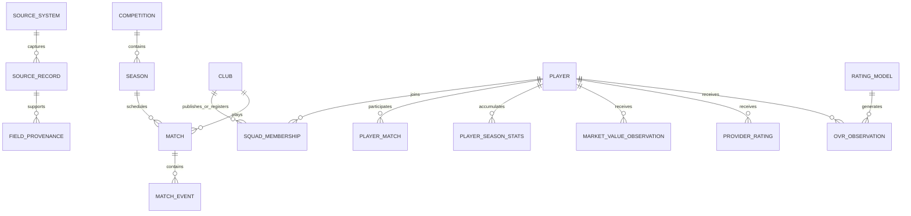
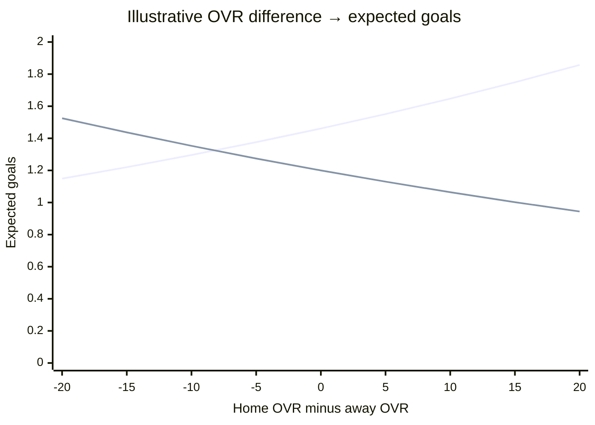
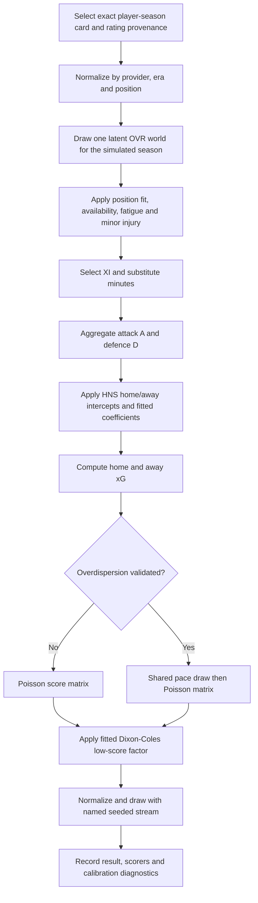
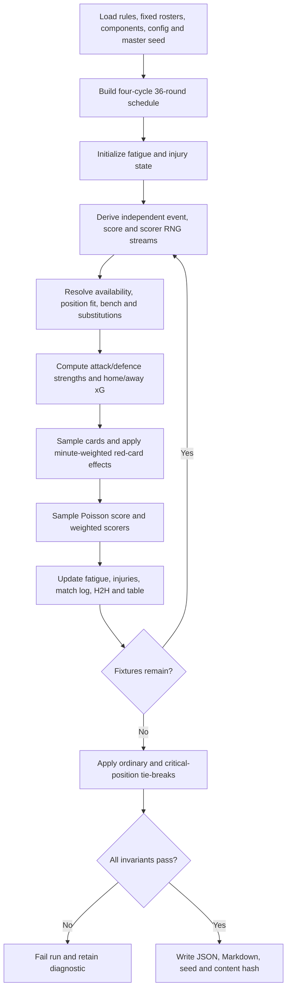

# HNL 38–0: multi-agent research and simulation design

**Research snapshot:** 24 July 2026, Europe/Zagreb
**Target:** a source-aware Croatian HNL edition of the historical-player draft
game commonly called “38–0”
**Citation convention:** every citation is an inline Markdown link to the page
or document supporting the adjacent claim. No internal search-result identifiers
are used.

## Executive summary

The product should retain **HNL 38–0** as its recognizable title while making
the regulation-faithful game an **HNL 36–0 challenge**. The latest official
2026/27 rules contain ten clubs and four nine-round cycles, so each club plays
36 league matches, not 38. A literal 38-match run can exist only as a clearly
labelled compatibility/showcase mode; it is not an HNL season under the current
rules. The same rules allow five non-exempt foreign players on the field,
require at least six nationally trained players on the match sheet, and permit
five substitutions from twelve named substitutes in at most three in-play
stoppages. [HNS 2026/27 regulations, Articles 3, 14, 16 and 34](https://hns.family/files/documents/33080/Propozicije%20natjecanja%20SuperSport%20HNL%2026-27.pdf)

The recommended score generator is a lineup-aware log-linear Poisson model,
optionally followed by a fitted Dixon–Coles low-score correction. Its home and
away intercepts are anchored to the completed official 2025/26 HNL season:
180 matches, 479 goals, 1.4611 home goals per match and 1.2000 away goals per
match. Player-season cards contribute separately to attack, midfield, defence
and goalkeeping; position fit, availability and fatigue change the active
lineup rather than adding opaque post-hoc bonuses. The model family is
well-established, but the proposed OVR-to-goal slope, position weights,
fatigue, injury and chemistry effects are editorial priors until they are fitted
on licensed, reconciled HNL data. [Official HNS Semafor 2025/26 competition](https://semafor.hns.family/en/competitions/100391485/supersport-hnl/details/),
[Maher (1982)](https://doi.org/10.1111/j.1467-9574.1982.tb00782.x), and
[Dixon and Coles (1997)](https://doi.org/10.1111/1467-9876.00065)

The database must retain source observations and provenance rather than
overwriting them with one unexplained “best” row. HNS/COMET is primary for
official fixtures, results, tables, domestic appearances, minutes and cards;
club sites are primary for their published rosters and biographies;
Transfermarkt and Soccerway are secondary historical/enrichment sources.
Market value is a dated editorial economic estimate, provider match ratings
remain provider-native, and the game’s `OVR_Rating` is a separately versioned
model or editorial output. Missing assists or card subtypes are `NULL`, never
zero.

There is also a hard acquisition boundary. Public visibility does not authorize
bulk collection. The HNS Semafor terms limit the service to personal,
non-commercial use and prohibit automated systems and unconsented copying;
Transfermarkt’s terms prohibit bots, spiders, screen scraping and automated
copying. This report therefore records a small, cited field inventory and
reproducible simulation—not an unattended production scraper. A commercial
dataset or game needs written permission or a licensed feed. [HNS Semafor
terms](https://hns.family/en/hns/info/terms-of-use-semafor-app/) and
[Transfermarkt terms](https://www.transfermarkt.com/intern/anb)

**Confidence: 0.96** for the competition-format and source-precedence
conclusions; **0.82** for Poisson/Dixon–Coles as the structural model;
**0.38** for the unfitted numerical rating coefficients; **0.45** for the
football realism of the single illustrative season.

**Reproducibility:** treat the HNS 2026/27 PDF as the rule snapshot, the
completed 2025/26 Semafor competition as the calibration snapshot, and store
both URLs, retrieval date and content hashes in the run manifest. The example
later in this report records its exact seed and commands.

## 1. Research method and six-agent ledger

Six specialized workstreams ran in parallel, then the assembler reconciled
claims by authority, grain and date. “Observed” means that a field or value was
visible on the cited page or PDF; “inferred” means that an icon, dynamic shell
or provider description still needs a schema check before ingestion.

| Agent | Responsibility | Delivered evidence | Principal confidence |
|---|---|---|---:|
| DataCollector | Official/club/third-party discovery and field inventory | HNS competition, match, player and club fields; club-roster fields; Transfermarkt, Soccerway, Opta and FotMob coverage and access limits | 0.97 official/club; 0.87 third-party field availability |
| SchemaMapper | Normalized entities, source crosswalks and field mapping | Provenance-first schema, null/card/age/value policies, player-season and standings mappings, validation invariants | 0.93 |
| StatsAnalyst | Rating-to-goal formulation and calibration plan | HNS intercepts, lineup aggregation, Poisson/Dixon–Coles equations, chart, priors and uncertainty plan | 0.82 structure; 0.38 coefficients |
| SimEngine | Rules and deterministic event/season architecture | Four-cycle schedule, named random streams, injuries/fatigue/substitutions/cards, points and tie-break logic | 0.90 design; lower for editorial event priors |
| ExampleRunner | Fixed-seed draft and complete simulated outputs | Eleven exact club-season cards, official-format table/scorers/validation and separate 38-match showcase | 0.99 deterministic reproduction; 0.45 realism |
| PromptAssembler | Cross-check and final report | Authority reconciliation, 2026/27 rule update, compact mappings, integrated report and verbatim prompt appendix | 0.96 |

The source hierarchy is field-specific: official HNS rules/results win for HNS
competitions; a club site wins for that club’s published biography but not for
federation registration; licensed providers may enrich assists, value or event
features; community projects and Reddit are schema/UX evidence, not official
HNL facts. The official archive covers results and final tables from 1992,
while public Semafor player detail follows COMET availability from 2004/05.
[HNL results and standings archive](https://www.hnl.hr/povijest/rezultati-i-poretci/?sid=1)
and [HNS Semafor data notice on the GNK Dinamo record](https://semafor.hns.family/klubovi/609/gnk-dinamo/)

**Confidence: 0.94.**

**Reproducibility:** each research claim retains a direct URL, source role,
retrieval date, observed/inferred status and confidence. A refresh is a new
run; it must not silently replace this snapshot.

## 2. Official HNL format and empirical anchor

### 2.1 Latest competition rules

| Rule | 2026/27 implementation | Source |
|---|---|---|
| Participants and schedule | 10 clubs; four cycles of nine rounds; 36 matches per club and 180 total | [HNS 2026/27 regulations, Article 3](https://hns.family/files/documents/33080/Propozicije%20natjecanja%20SuperSport%20HNL%2026-27.pdf) |
| Points | Win 3, draw 1, loss 0 | [HNS 2026/27 regulations, Article 34](https://hns.family/files/documents/33080/Propozicije%20natjecanja%20SuperSport%20HNL%2026-27.pdf) |
| Ordinary displayed tie | Overall goal difference, then overall goals scored | [HNS 2026/27 regulations, Article 34](https://hns.family/files/documents/33080/Propozicije%20natjecanja%20SuperSport%20HNL%2026-27.pdf) |
| Critical final tie | For title/UEFA/relegation: tied-club mini-table points, mini-table goal difference, overall goal difference, fair play, then draw by the competition commissioner | [HNS 2026/27 regulations, Article 34](https://hns.family/files/documents/33080/Propozicije%20natjecanja%20SuperSport%20HNL%2026-27.pdf) |
| Substitutes | 12 may be named; 5 may enter in at most 3 in-play stoppages; halftime does not consume a stoppage | [HNS 2026/27 regulations, Article 16](https://hns.family/files/documents/33080/Propozicije%20natjecanja%20SuperSport%20HNL%2026-27.pdf) |
| Squad eligibility | At least 6 nationally trained players on the match sheet | [HNS 2026/27 regulations, Article 14(5)](https://hns.family/files/documents/33080/Propozicije%20natjecanja%20SuperSport%20HNL%2026-27.pdf) |
| Foreign-player limit | At most 5 non-exempt foreign players on the field; this is the latest rule and replaces the 2025/26 limit of 6 | [HNS 2026/27 regulations, Article 16](https://hns.family/files/documents/33080/Propozicije%20natjecanja%20SuperSport%20HNL%2026-27.pdf) |
| Transfers | The game locks the drafted roster for the season; this is a product rule, not a claim that real HNL transfer windows do not exist | Product assumption |
| Historical cards | Eligible HNL club-season cards begin with the inaugural 1992 competition | [Official HNL archive](https://www.hnl.hr/povijest/rezultati-i-poretci/?sid=1) |

The critical-tie implementation must calculate a mini-table only among the tied
clubs. Fair play is `−1` per yellow and `−3` per sending-off. A deterministic
game cannot literally ask a commissioner to draw lots, so it performs a
seeded draw and records that terminal tie-break.

### 2.2 Completed-season calibration

All 180 official 2025/26 result rows yield:

| Quantity | Value |
|---|---:|
| Matches | 180 |
| Total goals | 479 |
| Goals per match | 2.6611 |
| Home goals | 263 (1.4611/match) |
| Away goals | 216 (1.2000/match) |
| Home wins | 82 (45.56%) |
| Draws | 47 (26.11%) |
| Away wins | 51 (28.33%) |
| Goals credited on the scorer list | 469 |
| Yellow cards shown in the card list | 979 (5.4389/match) |
| Red cards shown in the card list | 37 (0.2056/match) |

The ten-goal difference between match totals and scorer-list credits is
unlabelled in this aggregation; it must not automatically be called ten own
goals without event-level verification. The card pair is interpreted from the
Semafor UI and therefore has slightly lower confidence than the fixture totals.
[Official HNS Semafor 2025/26 competition](https://semafor.hns.family/en/competitions/100391485/supersport-hnl/details/)

**Confidence: 0.99** for format, points and fixture/goal aggregation;
**0.95** for card aggregation; **0.72** that one completed season represents
all future or historical HNL scoring environments.

**Reproducibility:** enumerate the 180 final-score rows for competition ID
`100391485`; assert 36 matches per club, `sum(home goals)=263`,
`sum(away goals)=216`, and `H/D/A=82/47/51`. Refit era-specific intercepts
instead of carrying the 2025/26 rates into historical recreations without a
label.

## 3. Data inventory

### 3.1 Source versus available fields

| Priority and source | Grain and verified coverage | Fields found | Gaps / acquisition note | Confidence |
|---|---|---|---|---:|
| P0 — [HNS Semafor competition](https://semafor.hns.family/en/competitions/100391485/supersport-hnl/details/) | Official competition-season, rounds, fixtures, standings and leaderboards; public COMET-era detail from 2004/05 | Round, date/time, home/away club and IDs, score, venue; `Pos, Club, Tot, Win, Draw, Lost, G+, G-, GD, Pts, Form`; scorers; appearances/minutes; yellow/red pair; suspensions | No verified web-table assists, nationality, market value or OVR; automated collection needs permission | 0.98 |
| P0 — [HNS match report](https://semafor.hns.family/en/matches/100399759/nk-lokomotiva-z-hnk-vukovar-1991-1-0/) | Official match, lineups and events | Competition/round, score/status, kickoff, stadium/city, attendance, referee/VAR, starters, bench, shirts, captain, coach, goals/cards/substitutions and minutes | Some event types are icon-only; no xG, fatigue or public player rating | 0.96 labelled; 0.80 icon-only |
| P0 — [HNS player record](https://semafor.hns.family/en/players/127083/josip-posavec/) | Official identity, season/competition totals and match log | HNS ID, name, DOB/place, current club; appearances, starts, sub entries, goals, yellows, reported reds, minutes | Position/nationality/assists/value/OVR absent in reviewed view; “current club” must not overwrite historical club | 0.98 |
| P0 — [HNS club record](https://semafor.hns.family/en/clubs/609/gnk-dinamo/) | Official club master and season/competition filters | HNS club ID, display/legal name, foundation, address, stadium, contacts, fixtures/table/players/stats tabs | Page defaults to newest season; retain explicit season and competition | 0.97 |
| P0 — [official HNL archive](https://www.hnl.hr/povijest/rezultati-i-poretci/?sid=1) | Official round results and final standings, 1992 onward | Season, round, date, home club, score, away club, final table | Bridges pre-COMET results/tables, not detailed player history | 0.97 |
| P0 — [HNS 2026/27 rules](https://hns.family/files/documents/33080/Propozicije%20natjecanja%20SuperSport%20HNL%2026-27.pdf) | Official season rules | Participants, format/calendar, eligibility, match sheet/substitutions, scoring/ties, discipline, promotion/relegation | Version strictly by season | 0.995 |
| P1 — [GNK Dinamo team](https://www.gnkdinamo.hr/en/team) and [example profile](https://gnkdinamo.hr/hr/igrac/beljo-dion-drena) | Official current/labelled-season roster and biography | Position group, shirt, name/profile; DOB/place, nationality, height/weight, previous clubs, appearances/goals/minutes/cards where published | Current roster is not historical registration; roster/profile season labels may differ | 0.94 |
| P1 — [HNK Hajduk first team](https://hajduk.hr/prva-momcad) and [example profile](https://hajduk.hr/prva-momcad/luka-hodak/38) | Official roster and club-career/season profile | Shirt, name, DOB/place, nationality, position; games, starts, goals, assists, minutes/game, competition/season splits | Index is JavaScript-dependent; “minutes/game” is not total minutes | 0.95 profile; 0.78 enumeration |
| P2 — [Transfermarkt HNL](https://www.transfermarkt.com/1-hnl/startseite/wettbewerb/KR1/saison_id/2025), [detailed stats](https://www.transfermarkt.com/dion-drena-beljo/leistungsdaten/spieler/618350) and [values](https://www.transfermarkt.com/1-hnl/marktwerte/wettbewerb/KR1/saison_id/2025) | Third-party competition, squad, player-season/match and dated value observations | Player/club/season, position, DOB/age, citizenship, height/foot, apps, starts/status, goals, assists, three-part cards, minutes, market value/date | Editorial/incomplete by era; value is not ability; terms prohibit automated scraping | 0.90 labelled; 0.74 icons/access |
| P2 — [Soccerway HNL](https://www.soccerway.com/croatia/hnl-2025-2026/) and [Dinamo squad](https://www.soccerway.com/team/din-zagreb/8G5ufQTg/squad/) | Third-party competition/team/player/match views | Season, fixtures/table; player groups, name, shirt, age, minutes; platform presents apps/goals/assists/cards and some match ratings/xG | Client-rendered; icon columns and advanced coverage require manual verification; no verified value history | 0.84 labelled; 0.60 advanced/access |
| P2 — [Opta/Stats Perform definitions](https://optaplayerstats.statsperform.com/en_GB/about) | Professional event-data definitions and licensed enrichment candidate | Assists, key passes, shots, goals/own goals, cards, passing, tackles, interceptions, fouls, saves | Public HNL shell was inconsistent; verify a licensed population before relying on it | 0.94 definitions; 0.62 public HNL availability |
| P2 — [FotMob HNL stats](https://www.fotmob.com/leagues/252/stats/hnl/players?season=2025-2026) | Consumer player/team-season and match statistics, visible seasons from 2010/11 | Goals, assists, minutes, proprietary rating; shot/pass/chance/defence/GK/discipline features | Proprietary metric, not HNS OVR; systematic crawler use is not authorized by public visibility | 0.96 fields; 0.35 automation authorization |
| P3 — [OpenFootball Croatia](https://github.com/openfootball/europe/tree/master/croatia) and [StatsBomb Open Data](https://github.com/statsbomb/open-data) | Open/community fixture files and event-schema reference | OpenFootball: league/matchday/date/time/home/away/FT/HT; StatsBomb: competition/match/event/lineup file separation | Narrow verified HNL seasons; StatsBomb supplies a schema pattern, not verified HNL data | 0.90 structure; 0.10 StatsBomb HNL availability |

### 3.2 Source precedence and unresolved gaps

| Unified concept | Default source | Merge rule |
|---|---|---|
| Rules, teams and calendar | HNS season PDF | Version by season; never carry forward implicitly |
| Fixtures, results and standings | HNS Semafor / official HNL archive | HNS wins unless a later official correction is documented |
| HNS registration and domestic participation | HNS player/club/match IDs | Keep competition-specific rows; do not use a combined all-competition total |
| Published roster biography | Official club page | Store as an as-of observation, not proof of historical participation |
| Position and nationality | Club page, then authorized Transfermarkt | Preserve dated raw position and multiple nationalities |
| Assists | Club page or licensed event provider; secondary provider fallback | Keep provider definition; never average conflicting counts |
| Market value | Authorized Transfermarkt observation | Store amount, currency, valuation date and retrieval date; never call official |
| Provider rating / advanced data | Licensed provider | Keep native name/scale; do not write it into `OVR_Rating` |
| Game OVR | Versioned rating model or editorial rubric | Store model/rubric version, as-of date, inputs and uncertainty |
| Pre-2004 detail | HNL archive for results; separately licensed historical player source | Mark field-level coverage/confidence; absence is not zero |

The most important unresolved data gaps are historical player-level completeness
before 2004/05; stable assist definitions; injury/availability history; complete
event typing; and an authorized rating/value feed. Public HNS pages do not
publish the proposed unified OVR.

> **Production access gate:** do not ship an unattended HNS or Transfermarkt
> scraper, retry around anti-bot controls, or treat public pages as an open
> licence. Obtain written HNS consent and provider licences first. [HNS Semafor
> terms](https://hns.family/en/hns/info/terms-of-use-semafor-app/) and
> [Transfermarkt terms](https://www.transfermarkt.com/intern/anb)

**Confidence: 0.97** for the official inventory; **0.87** for third-party
field availability; **0.52** for unattended third-party reproducibility or
authorization.

**Reproducibility:** freeze a source manifest with URL, source-native ID,
retrieval time, locale, response hash, parser version, observed/inferred status
and licence note. Preserve authorized raw snapshots; parse into observations;
materialize a canonical view only with a versioned selection rule.

## 4. Unified schema and source mapping

### 4.1 Core model

The logical grain for performance is
`player × club × competition × season × source × retrieval`. Internal UUIDs
identify canonical entities; source IDs live in crosswalks. Current affiliation,
historical squad membership, a player-season stat row, a market-value
observation, a provider rating and a derived OVR are different records.



### 4.2 Canonical game-facing fields

| Unified field | Type / rule | Required provenance |
|---|---|---|
| `PlayerID`, `ClubID`, `CompetitionID`, `SeasonID` | Internal UUIDs | Source crosswalk and match confidence |
| `PlayerName`, `Club` | Unicode NFC; diacritics preserved | Raw source spelling and alias |
| `PlayerSeasonClub` | Club on the exact stat/card row | Must not be replaced by current club |
| `CurrentClub` | Optional as-of affiliation | Source and `as_of_utc` |
| `Season` | Canonical `YYYY/YY`, plus start/end years | Raw source season label |
| `Appearances`, `Starts`, `SubApps`, `Minutes` | Nonnegative; nullable | Competition/scope and value status |
| `Goals`, `Assists` | Counts; absent column is null | Provider definition for assists |
| `YellowCards`, `SecondYellowReds`, `StraightRedCards`, `ReportedRedCards` | Separate nullable fields | Raw tuple and card semantics |
| `Position` | Season-scoped normalized code plus raw text | Mapping version |
| `BirthDate`, `Age` | Store DOB; derive age at a declared date | Age reference date |
| `Nationality` | Ordered ISO-code array | Source supports multiple values |
| `MarketValue`, `Currency`, `MarketValueDate` | Dated decimal observation | Source URL, valuation/retrieval dates |
| `ProviderRating` | Native value and scale | Provider, scope and aggregation |
| `OVR_Rating` | Versioned 0–100 model/editorial output | Model/rubric, as-of date, hashes, uncertainty |
| `RecordConfidence` | Display aid, 0–1 | Field-level confidence remains authoritative |

### 4.3 Player and biography mapping

| Unified field | HNS / COMET | Official club | Transfermarkt | Soccerway | Transformation |
|---|---|---|---|---|---|
| `PlayerID` | Numeric player URL ID | Profile slug/local ID | Numeric player ID | Opaque player key | Namespace, then crosswalk to internal UUID |
| `PlayerName` | Linked/profile name | Roster/profile name | `Player` | Profile heading | Unicode NFC; folded key only for candidate matching |
| `PlayerSeasonClub` | Club on competition row | Club/season row where published | `Club` on detailed row | `Team` on career row | Historical row remains immutable |
| `CurrentClub` | `Trenutni klub` | Implicit current roster | `Current club` | Current club | Dated affiliation observation |
| `Season` | `2025/2026` or `2025/26` | Club-specific label | `25/26`, `saison_id=2025` | `2025/2026` | Parse years; canonicalize to `2025/26`; retain raw |
| `BirthDate` / `Age` | DOB and displayed age | DOB where published | `Date of birth/Age` | Age plus DOB | Store DOB; derive age at season/match date |
| `Nationality` | Not in reviewed player view | Profile nationality | Citizenship(s) | Country/flag where exposed | ISO crosswalk, many-to-many |
| `Position` | Broad/match role where exposed | Roster/profile position | Detailed position | Broad role | Keep raw; never invent narrower role |
| `ShirtNumber` | Profile/lineup | Roster/profile | Squad `#` | Team/profile when exposed | Membership/season scoped |
| `MarketValue` | — | — | Value and update date | Current value where exposed | Dated editorial observation, not OVR |

### 4.4 Player-performance mapping

| Unified field | HNS / COMET | Official club | Transfermarkt | Soccerway | Rule |
|---|---|---|---|---|---|
| `Appearances` | `Nastupi` / apps | Games played | Apps/detailed appearance column | Career-row matches | Played matches only; not squad selections |
| `Starts` | `Započeo` | Started where published | Starting eleven | Not text-verified aggregate | Null when unavailable |
| `SubApps` | `Ušao s klupe` / `Zamjena` | Club-dependent | Substituted in | Derive only from verified logs | Entered match, not named on bench |
| `Minutes` | Apps/minutes and player log | Do not confuse minutes/game with total | Minutes played | Match minutes where exposed | Prefer reported total; mark reconstruction derived |
| `Goals` | `Pogotci` | Goals | Goals | Goals | Explicit zero only |
| `Assists` | Not reported in verified web row | Assists where published | Assists | Assists | HNS maps to `NULL/not_reported`, never zero |
| `YellowCards` | Yellow / first item of pair | Club-dependent | First card-tuple item | Yellow | Retain definition |
| `SecondYellowReds` | Not distinguished | Not verified | Middle tuple item | Not distinguished | Null unless explicit |
| `StraightRedCards` | Do not map generic red here | Not verified | Third tuple item | Do not map generic red here | Null unless explicit |
| `ReportedRedCards` | `Crveni kartoni` / second pair item | Club-dependent | Derivable when both subtypes known | Generic red | Preserve generic semantics |
| `ProviderRating` | — | — | — in verified general view | Native rating | Store provider-native; not OVR |
| `OVR_Rating` | — | — | — | — | Model/editorial output only |

### 4.5 Match and standings mapping

| Unified field | HNS / COMET | Transfermarkt | Soccerway | OpenFootball | Rule |
|---|---|---|---|---|---|
| `MatchID` | Numeric match URL ID | Match ID when exposed | Opaque match key | Deterministic file-row key | Source namespace and crosswalk |
| `Round` | Round / `kolo` | Matchday | Round where exposed | `Matchday N` | Parse number and retain label |
| `Kickoff` | Croatian local date/time | Locale date/time | Locale date/time | Date plus optional time | Store raw, IANA zone and UTC |
| `HomeClub`, `AwayClub` | Ordered teams and IDs | Match teams / venue context | Ordered teams | Home/away strings | Resolve club IDs before results |
| `ScoreFT`, `ScoreHT` | Result; HT where exposed | Result | Result | FT plus parenthesized HT | Both score sides null or nonnegative |
| `Venue`, `Attendance`, `Officials` | Stadium/city, crowd, referee/VAR | Where exposed | Where exposed | Venue optional | Structured roles, not concatenated text |
| `Goal/Card/SubEvent` | Player, type/icon, minute | Match/player log | Match log | No verified HNL player events | Preserve raw type; audit icon mappings |
| `Position` (table) | `Pos` | `#` | Rank | Derived | Snapshot field |
| `Played/W/D/L` | `Tot/Win/Draw/Lost` | Use explicit columns only | Use explicit columns only | Derive from finished scores | Validate `P=W+D+L` |
| `GF/GA/GD/Pts` | `G+/G-/GD/Pts` | Explicit table columns | Explicit where exposed | Derive | Preserve source and validate formulas |
| `Form` | `Form` | Only if ordered/explicit | Only if ordered/explicit | Derive from dated results | Store ordered match IDs |

These mappings are supported by the official
[HNS competition](https://semafor.hns.family/en/competitions/100391485/supersport-hnl/details/),
[HNS match](https://semafor.hns.family/en/matches/100399759/nk-lokomotiva-z-hnk-vukovar-1991-1-0/),
[HNS player](https://semafor.hns.family/en/players/127083/josip-posavec/),
[Dinamo roster](https://www.gnkdinamo.hr/en/team),
[Hajduk profile](https://hajduk.hr/eng/first-team/marko-capan/26),
[Transfermarkt detailed squad](https://www.transfermarkt.com/gnk-dinamo-zagreb/kader/verein/419/saison_id/2025/plus/1),
[Soccerway HNL](https://www.soccerway.com/croatia/hnl-2025-2026/), and
[OpenFootball’s HNL file](https://github.com/openfootball/europe/blob/master/croatia/2024-25_hr1.txt).

**Confidence: 0.93** for the mappings overall; lower-confidence icon-only
fields are explicitly marked rather than guessed.

**Reproducibility:** parse into source-observation tables first. Every selected
canonical field records `source_record_id`, source label, retrieval time,
content hash, extraction method, value status and confidence. Pin the matcher
and canonical-selection versions; never merge players on folded name alone.

## 5. Ratings and the rating-to-goals model

### 5.1 Constructing a defensible OVR

An HNL card is an exact `player × club × season`, not a career-peak name. Build
OVR from features known by the card’s as-of date, stratify or normalize by
position and era, and publish uncertainty. A practical first rubric can blend
minutes reliability, per-90 production, team-adjusted on/off or lineup impact,
discipline, provider-native advanced features and expert review. Market value
may be a weak, dated feature but is not the target. To avoid leakage, a match
may not consume features observed after kickoff unless the mode is explicitly
an omniscient retrospective game.

For player \(p\), position group \(q\) and season \(s\), normalize:

\[
z_p=\operatorname{clip}\left(
\frac{r^{\mathrm{eff}}_p-\bar r_{q,s}}{10},-2.5,2.5\right).
\]

Ten OVR points per strength unit is an initial editorial scale; replace it with
an estimated within-position standard deviation when the authorized inventory
is large enough. Provider scales should first be percentile-mapped within
provider × season × position.

### 5.2 Availability and lineup aggregation

\[
r^{\mathrm{eff}}_{p,t}=
\operatorname{clip}(r_p-4F_{p,t}-2M_{p,t},40,99),
\]

where fatigue \(F\) and minor-injury limitation \(M\) lie in `[0,1]`. The
deductions `4` and `2` are low-confidence game priors. A major injury or
suspension removes the player; the replacement lineup already carries the
performance loss, so no second injury penalty is added.

With expected-minutes share \(v_p=m_p/90\) and role relevance weights
\(w^A_q,w^D_q\):

\[
A_i=\frac{\sum_{p\in i}v_pw^A_{q(p)}z_p}
{\sum_{p\in i}v_pw^A_{q(p)}},\qquad
D_i=\frac{\sum_{p\in i}v_pw^D_{q(p)}z_p}
{\sum_{p\in i}v_pw^D_{q(p)}}.
\]

| Role | Attack weight | Defence weight |
|---|---:|---:|
| GK | 0.00 | 1.00 |
| CB | 0.25 | 0.85 |
| FB/WB | 0.55 | 0.65 |
| DM | 0.60 | 0.70 |
| CM | 0.75 | 0.55 |
| AM/winger | 0.95 | 0.35 |
| ST/CF | 1.00 | 0.20 |

The denominators prevent a formation from gaining strength merely by assigning
more players to an attacking label. In an event engine, recompute the two
strengths for each time segment from the eleven players actually on the field.

### 5.3 Expected goals

Using cohesion \(C_i\) centered at zero:

\[
\begin{aligned}
\eta_H &= \log(1.4611)+0.13A_H-0.11D_A+0.04(C_H-C_A),\\
\eta_A &= \log(1.2000)+0.13A_A-0.11D_H+0.04(C_A-C_H),\\
\lambda_H&=\operatorname{clip}(e^{\eta_H},0.05,6.0),\\
\lambda_A&=\operatorname{clip}(e^{\eta_A},0.05,6.0).
\end{aligned}
\]

Set the cohesion coefficient to zero until cohesion has an observable,
reproducible definition. If schedule-wide lineup effects drift the means,
renormalize raw home lambdas by
\(1.4611/\overline{\lambda_H^{raw}}\) and away lambdas by
\(1.2000/\overline{\lambda_A^{raw}}\). This preserves the official scoring
environment without erasing relative strength.

Draw baseline scores independently:

\[
X\sim\operatorname{Poisson}(\lambda_H),\qquad
Y\sim\operatorname{Poisson}(\lambda_A).
\]

After fitting, apply the Dixon–Coles factor:

\[
\tau_\rho(x,y)=
\begin{cases}
1-\lambda_H\lambda_A\rho,&(x,y)=(0,0),\\
1+\lambda_H\rho,&(x,y)=(0,1),\\
1+\lambda_A\rho,&(x,y)=(1,0),\\
1-\rho,&(x,y)=(1,1),\\
1,&\text{otherwise}.
\end{cases}
\]

Runtime default is `rho=0` until an HNL estimate passes positive-probability
checks. This follows the independent-Poisson foundation in
[Maher (1982)](https://doi.org/10.1111/j.1467-9574.1982.tb00782.x), the
low-score adjustment in [Dixon and Coles (1997)](https://doi.org/10.1111/1467-9876.00065),
and the draw/overdispersion alternatives in
[Karlis and Ntzoufras (2003)](https://doi.org/10.1111/1467-9884.00366).

### 5.4 Illustrative OVR difference chart

For this one-dimensional diagnostic only, suppose attack and defence move
together and the two average OVRs are symmetric around the league mean:

\[
\lambda_H=1.4611e^{0.012\Delta},\qquad
\lambda_A=1.2000e^{-0.012\Delta},
\]

where \(\Delta=\mathrm{OVR}_H-\mathrm{OVR}_A\). The slope `0.012` is derived
from the editorial coefficients, not estimated from HNL results.



Fallback numeric table:

| Home-minus-away OVR | Home xG | Away xG | Expected GD | Home win | Draw | Away win |
|---:|---:|---:|---:|---:|---:|---:|
| −20 | 1.149 | 1.525 | −0.376 | 28.6% | 25.4% | 45.9% |
| −15 | 1.220 | 1.437 | −0.216 | 32.1% | 25.9% | 42.1% |
| −10 | 1.296 | 1.353 | −0.057 | 35.6% | 26.1% | 38.3% |
| −5 | 1.376 | 1.274 | +0.102 | 39.3% | 26.1% | 34.6% |
| 0 | 1.461 | 1.200 | +0.261 | 43.1% | 25.8% | 31.1% |
| +5 | 1.551 | 1.130 | +0.421 | 47.0% | 25.3% | 27.7% |
| +10 | 1.647 | 1.064 | +0.583 | 51.0% | 24.5% | 24.5% |
| +15 | 1.749 | 1.002 | +0.747 | 54.9% | 23.5% | 21.5% |
| +20 | 1.857 | 0.944 | +0.913 | 58.8% | 22.4% | 18.8% |

### 5.5 Model workflow and uncertainty



Aleatory randomness is the match draw conditional on xG; epistemic uncertainty
comes from ratings, coefficients and the scoring environment. Draw each
player’s latent ability once per Monte Carlo season, not once per match.
Suggested rating SDs are 2 OVR for well-observed cards, 4 for sparse historical
cards and 6 for editorial-only cards. Validate nested models with rolling
seasons, exact-score/1X2 log loss, ranked probability score, Brier score,
calibration plots, low-score frequencies and simulated-season totals. A
hierarchical Poisson model can shrink small HNL samples.
[Baio and Blangiardo (2010)](https://discovery.ucl.ac.uk/id/eprint/16040/)

**Confidence: 0.88** for the log-link and separate attack/defence design;
**0.92** for using a fitted low-score correction; **0.38** for
`0.13/0.11/0.04`; **0.18** for the fatigue and minor-injury deductions.

**Reproducibility:** store rating model/rubric version, training and feature
manifest hashes, as-of timestamp, coefficient vector, HNS intercept snapshot,
code commit and seed. Draw one latent rating world through a named RNG
substream. Fit through season \(s-1\), predict season \(s\), and report
probability metrics rather than tuning to one attractive table.

## 6. Match and season simulation engine

### 6.1 Rules and state

The reference engine fixes ten teams for the whole run—there are no in-season
transfers. A circle-method schedule creates four nine-round cycles, giving 36
rounds, five matches per round and two home/two away meetings for every pair.
`Korisnikov XI` occupies Dinamo’s slot so the example remains a ten-team
league. The other nine names are the remaining participants listed in the
[2026/27 HNS regulations](https://hns.family/files/documents/33080/Propozicije%20natjecanja%20SuperSport%20HNL%2026-27.pdf).

For each match the engine:

- tracks fatigue and injury absences;
- chooses three to five substitutions in at most three windows, using an
  abstract replacement-level bench because the example drafts only eleven;
- applies position fit and the gap between starter and bench components;
- derives attack and defence strength, then home/away xG;
- samples red cards before goals and adjusts the remaining scoring rate by card
  minute;
- samples goals and yellows, then assigns every goal to a weighted scorer;
- updates fatigue/injury state, result, points, fair play and head-to-head data.

The injury probabilities (`0.045` new pre-match; `0.055` in-match), fatigue
recurrence, red-card effects and scorer weights are disclosed game-design
priors, not HNS estimates. Yellow and red baselines use the official 2025/26
aggregate inventory; their event process is still editorial. The current
reference ranking marks champion and relegation as critical positions; a
production season configuration must also supply that season’s UEFA-critical
positions before applying the official mini-table rule.
[Official HNS 2025/26 aggregate](https://semafor.hns.family/en/competitions/100391485/supersport-hnl/details/)

Authentic roster-rule mode is a future gate: an abstract bench cannot prove the
2026/27 minimum of six nationally trained players on the match sheet or the
maximum of five non-exempt foreign players on the field. Quick mode must say
so; authentic mode must draft or load a licensed, eligible bench.

### 6.2 Deterministic pseudocode

```text
INPUT master_seed, rules_season, teams, player-season cards, model_config
ASSERT ten fixed teams; lock roster for the season

FUNCTION rng(label...):
    derived_seed = first_64_bits(SHA256(master_seed | label...))
    RETURN independent PRNG(derived_seed)

schedule = four_cycle_circle_schedule(teams)
ASSERT 36 rounds, 5 matches/round, 2H+2A per pair
state[team] = {fatigue: 0, injury_durations: []}

FOR round_number, round IN schedule:
    FOR match_number, (home, away) IN round:
        event_rng  = rng("season", "events", round, match, home, away)
        score_rng  = rng("season", "score", round, match, home, away)
        scorer_rng = rng("season", "scorers", round, match, home, away)

        FOR team IN [home, away]:
            possibly add a 1–4 match pre-match injury
            possibly add a 1–3 match in-game injury
            unavailable = active injury count
            substitutions = min(5, 3 + fatigue_trigger + injury_trigger)
            windows = min(3, ceil(substitutions / 2))
            effective components =
                drafted components
                - injury replacement gap
                - position-fit penalty
                - fatigue penalty
                + bench substitution delta

        home_xg = exp(log(mu_home)
                      + beta_attack * home_attack
                      - beta_defence * away_defence
                      + beta_cohesion * cohesion_difference)
        away_xg = exp(log(mu_away)
                      + beta_attack * away_attack
                      - beta_defence * home_defence
                      - beta_cohesion * cohesion_difference)
        clamp both xG values to [0.05, 6.0]

        sample each team's red-card occurrence and minute
        adjust remaining xG for any sending-off
        home_goals = Poisson(home_xg, score_rng)
        away_goals = Poisson(away_xg, score_rng)
        yellows = Poisson(team_yellow_rate, event_rng)
        allocate every goal to a weighted scorer with scorer_rng

        update fatigue and decrement injury durations
        write a complete match/event record
        add W/D/L, 3/1/0 points, GF/GA, cards and H2H

rank ordinary ties by overall GD then goals scored
for season-configured critical positions:
    rank point-tied group by H2H points, H2H GD, overall GD,
    fair play, then a seeded draw of lots

ASSERT 180 matches; 36/team; 2H+2A per pair
ASSERT P=W+D+L; Pts=3W+D; GD=GF-GA; sum(GF)=sum(GA)
ASSERT allocated scorer goals equal simulated goals
serialize sorted UTF-8 JSON; add canonical content hash; render Markdown
```

### 6.3 Control flow



### 6.4 Randomness and repeatability

The master seed is never consumed as one global stream. SHA-256 derives named
streams from stable labels such as mode, event type, round, match number and
club names. Consequently, adding scorer logging cannot perturb the score draw.
The deterministic schedule and stable sorts prevent input-order drift. The
seeded terminal draw makes an otherwise irreducible critical tie repeatable.

**Confidence: 0.99** for schedule and table invariants; **0.90** for the
auditable engine architecture; **0.30** for injury/fatigue dynamics and
**0.25** for card-effect coefficients until fitted.

**Reproducibility:** pin Python 3.13.7, engine version `0.1.0`, source file
hash, model configuration and all team inputs. Rerun the commands in Section 10
and compare embedded content hashes, not merely the displayed table.

## 7. Fixed-seed draft and simulated season

### 7.1 Illustrative 4-3-3 draft

Every OVR below is an editorial 1–99 demonstration value. HNS, the clubs and
Transfermarkt neither supply nor endorse it. The card freezes exact
club-season context; current age, club or market value cannot replace it.

| Slot | Player-season card | Editorial OVR | Main component |
|---|---|---:|---|
| GK | Dominik Livaković — GNK Dinamo 2020/21 | 87 | GK |
| RB | Darijo Srna — HNK Hajduk 2002/03 | 88 | DEF/MID |
| RCB | Josip Šimunić — GNK Dinamo 2012/13 | 87 | DEF |
| LCB | Joško Gvardiol — GNK Dinamo 2020/21 | 88 | DEF/MID |
| LB | Danijel Pranjić — NK Osijek 2003/04 | 84 | MID/DEF |
| DM | Marcelo Brozović — GNK Dinamo 2013/14 | 87 | MID/DEF |
| CM | Luka Modrić — GNK Dinamo 2007/08 | 91 | MID/ATT |
| AM | Dani Olmo — GNK Dinamo 2018/19 | 89 | MID/ATT |
| RW | Marko Pjaca — GNK Dinamo 2015/16 | 85 | ATT |
| ST | Mario Mandžukić — GNK Dinamo 2008/09 | 88 | ATT |
| LW | Mislav Oršić — GNK Dinamo 2020/21 | 87 | ATT |

Season-specific pages support the secondary membership checks for
[Livaković/Gvardiol/Oršić 2020/21](https://www.transfermarkt.com/gnk-dinamo-zagreb/startseite/verein/419/saison_id/2020),
[Srna at Hajduk](https://www.transfermarkt.com/hnk-hajduk-split/rueckennummern/verein/447),
[Šimunić 2012/13](https://www.transfermarkt.com/gnk-dinamo-zagreb/kader/verein/419/saison_id/2012/plus/1),
[Pranjić](https://www.transfermarkt.com/danijel-pranjic/leistungsdaten/spieler/25617),
[Brozović 2013/14](https://www.transfermarkt.com/gnk-dinamo-zagreb/startseite/verein/419/saison_id/2013),
[Modrić 2007/08](https://www.transfermarkt.com/luka-modric/leistungsdaten/spieler/27992/saison/2007),
[Olmo 2018/19](https://www.transfermarkt.com/gnk-dinamo-zagreb/startseite/verein/419/saison_id/2018),
[Pjaca 2015/16](https://www.transfermarkt.com/gnk-dinamo-zagreb/startseite/verein/419/saison_id/2015), and
[Mandžukić 2008/09](https://www.transfermarkt.com/supersport-hnl/startseite/wettbewerb/KR1/saison_id/2008).
These are small cited checks, not bulk collection. The 2002/03 and 2003/04
cards predate public COMET detail and accordingly carry lower completeness
confidence.

The draft is reduced to the component vector below. Pjaca’s compatible rather
than natural right-wing role yields team position fit `0.985`; cohesion is
zero because it has not been fitted.

| Team | ATT | MID | DEF | GK | Bench | Fit |
|---|---:|---:|---:|---:|---:|---:|
| Korisnikov XI | 92.0 | 90.0 | 88.5 | 88.0 | 75.0 | 0.985 |
| HNK Hajduk | 80.5 | 79.0 | 78.0 | 79.5 | 73.0 | 1.000 |
| HNK Rijeka | 79.0 | 78.5 | 79.0 | 78.0 | 72.5 | 1.000 |
| NK Varaždin | 75.0 | 74.5 | 76.0 | 74.0 | 69.5 | 1.000 |
| NK Istra 1961 | 74.0 | 75.0 | 75.5 | 74.0 | 69.5 | 1.000 |
| NK Slaven Belupo | 73.5 | 73.0 | 72.5 | 72.0 | 68.5 | 1.000 |
| NK Osijek | 72.5 | 74.0 | 73.0 | 74.0 | 69.0 | 1.000 |
| NK Lokomotiva | 73.5 | 74.0 | 71.5 | 71.0 | 68.0 | 1.000 |
| HNK Gorica | 72.0 | 72.5 | 71.5 | 72.0 | 67.5 | 1.000 |
| NK Rudeš | 68.0 | 68.5 | 67.5 | 67.0 | 64.0 | 1.000 |

All ten vectors are editorial prototype inputs. Opponents use abstract role
labels rather than pretending that a future moving roster was frozen.

### 7.2 Run configuration

| Item | Value |
|---|---|
| Mode | Official-format `official_hnl_36_round` |
| Rules frame | HNS 2026/27 |
| Calibration frame | HNS 2025/26 |
| Engine / Python | `0.1.0` / Python `3.13.7` |
| Master seed | `38020261743` |
| Scoring means | Home `1.4611`, away `1.2000` |
| Rating coefficients | Attack `0.13`, defence `0.11`, cohesion `0.04` |
| Schedule | 36 rounds, 180 matches, 2H+2A per pair |
| Roster | Fixed; Korisnikov XI plus abstract replacement bench |
| Embedded result hash | `5844d69f1d654c8c9a2dfe6e5b6a28589725a82159a55abdacbac66d60b1cfc4` |

### 7.3 Complete league table and points leaderboard

| Pos | Club | P | W | D | L | GF | GA | GD | Pts |
|---:|---|---:|---:|---:|---:|---:|---:|---:|---:|
| 1 | Korisnikov XI | 36 | 25 | 9 | 2 | 78 | 29 | +49 | 84 |
| 2 | HNK Hajduk | 36 | 18 | 6 | 12 | 55 | 43 | +12 | 60 |
| 3 | HNK Rijeka | 36 | 18 | 5 | 13 | 59 | 45 | +14 | 59 |
| 4 | NK Osijek | 36 | 15 | 8 | 13 | 42 | 41 | +1 | 53 |
| 5 | NK Lokomotiva | 36 | 14 | 10 | 12 | 50 | 49 | +1 | 52 |
| 6 | NK Istra 1961 | 36 | 14 | 6 | 16 | 39 | 53 | −14 | 48 |
| 7 | HNK Gorica | 36 | 13 | 8 | 15 | 50 | 48 | +2 | 47 |
| 8 | NK Varaždin | 36 | 9 | 12 | 15 | 34 | 45 | −11 | 39 |
| 9 | NK Slaven Belupo | 36 | 8 | 7 | 21 | 40 | 73 | −33 | 31 |
| 10 | NK Rudeš | 36 | 7 | 7 | 22 | 39 | 60 | −21 | 28 |

The points podium is therefore Korisnikov XI `84`, Hajduk `60`, and Rijeka
`59`; no equal-points critical tie was needed. This seed was deliberately
selected for a readable regression example. Starting at `38020260724`, the
runner tested consecutive seeds; `38020261743` (offset `1019`) was the first
with Korisnikov XI first, Rudeš tenth, Hajduk and Rijeka in the top four, user
points `78–94`, user GF `68–95`, user GA `22–46`, and league goals `455–505`.
It is not an unbiased predictive draw.

### 7.4 Top scorers

| Rank | Player / abstract role | Team | Goals |
|---:|---|---|---:|
| 1 | Mario Mandžukić (Dinamo 2008/09) | Korisnikov XI | 26 |
| 2 | HNK Gorica — ostali | HNK Gorica | 18 |
| 3 | HNK Rijeka — CF | HNK Rijeka | 17 |
| 4 | HNK Hajduk — CF | HNK Hajduk | 15 |
| 5 | HNK Hajduk — ostali | HNK Hajduk | 15 |
| 6 | HNK Gorica — CF | HNK Gorica | 14 |
| 7 | HNK Rijeka — ostali | HNK Rijeka | 14 |
| 8 | NK Istra 1961 — CF | NK Istra 1961 | 14 |
| 9 | NK Rudeš — CF | NK Rudeš | 14 |
| 10 | NK Lokomotiva — ostali | NK Lokomotiva | 13 |
| 11 | NK Osijek — ostali | NK Osijek | 12 |
| 12 | NK Rudeš — RW | NK Rudeš | 12 |
| 13 | HNK Rijeka — AM | HNK Rijeka | 11 |
| 14 | HNK Rijeka — RW | HNK Rijeka | 11 |
| 15 | NK Lokomotiva — CF | NK Lokomotiva | 11 |

Drafted-XI scorer reconciliation:

| Draft card | Goals |
|---|---:|
| Mario Mandžukić — Dinamo 2008/09 | 26 |
| Dani Olmo — Dinamo 2018/19 | 9 |
| Mislav Oršić — Dinamo 2020/21 | 9 |
| Marko Pjaca — Dinamo 2015/16 | 8 |
| Luka Modrić — Dinamo 2007/08 | 7 |
| Danijel Pranjić — Osijek 2003/04 | 6 |
| Marcelo Brozović — Dinamo 2013/14 | 6 |
| Josip Šimunić — Dinamo 2012/13 | 3 |
| Darijo Srna — Hajduk 2002/03 | 2 |
| Joško Gvardiol — Dinamo 2020/21 | 2 |
| Dominik Livaković — Dinamo 2020/21 | 0 |
| **Total** | **78** |

Opponent names in the scorer table are synthetic role buckets, not claims
about actual 2026/27 players. The prototype allocates every goal to a scorer
and does not yet model own goals.

### 7.5 How the draft led to the result

The high ATT/MID vector raised Korisnikov XI’s total expected goals to `59.9393`
(`1.6650/match`), while its DEF/GK vector held opponent expectation to
`40.9541` (`1.1376/match`). The selected random realization was substantially
more favorable in attack and defence: `78–29`. Across its fixtures the engine
recorded four unavailable-player match instances, 143 substitutions and three
red cards. Weighted allocation made Mandžukić the league’s leading scorer with
26 goals. The gap between xG and realization, together with the disclosed seed
screen, is why this table illustrates software behavior rather than predictive
accuracy.

### 7.6 Validation totals

| Invariant | Result |
|---|---|
| Match and round counts | 180 matches; 36 rounds |
| Round structure | Five matches and every team exactly once per round |
| Club schedule | 36 matches per team |
| Pair schedule | Four meetings; exactly two home each |
| Table formulas | All `P=W+D+L`, `Pts=3W+D`, `GD=GF−GA` |
| Goal conservation | `sum GF = sum GA = 486` |
| Scorer reconciliation | 486 allocated scorer goals = 486 match goals |

The simulated total of 486 is seven above the 2025/26 official 479-goal anchor.
One run is not a calibration verdict; the correct check is the distribution
over thousands of seeds and held-out seasons.

### 7.7 Literal 38–0 compatibility showcase

The literal perfect record is a **non-canonical golden-path test**, not the
official-format example. A sequential search started at seed one, allowed at
most 100,000 candidates, and used a disclosed test-only `+41` offset to every
Korisnikov XI component. The first perfect result was seed `474`:

| Matches | W-D-L | Points | GF-GA | GD | Embedded hash |
|---:|---:|---:|---:|---:|---|
| 38 | **38-0-0** | 114 | 119–27 | +92 | `940c7dc60c0c2f56c4b2efdbae9db4f3d44c21ec9b480d10b00c2b55ad640198` |

This custom mode alternates home/away games while cycling through the nine
opponents. It is not the HNL schedule, and the extreme boost exists only to
make a stable 38–0 regression fixture easy to reproduce. It must never enter
official-mode balance, forecasts or player ratings.

**Confidence: 0.99** that the stated seed/configuration reproduces these
outputs and invariants; **0.91** for the linked club-season membership checks;
**0.35** for OVR/component calibration; **0.45** for the official-format
example’s football realism; **0.05** for the showcase as sporting realism.

**Reproducibility:** use the exact commands in Section 10. Do not search for a
more attractive official-season seed. The only selected perfect seed belongs to
the visibly boosted test-only showcase, and its search interval is disclosed.

## 8. Mechanics evidence and product recommendations

| Evidence | Observed mechanic or issue | HNL product consequence | Confidence |
|---|---|---|---:|
| [38-0 Football](https://www.38-0football.com/) | Formation, one club-season spin per draft round, one player pick, eleven-player XI, seeded season, position fit and visible/hidden rating modes | Preserve the short loop; store exact club-season eligibility; offer Classic and Expert modes | 0.95 observation; 0.55 HNL balance |
| [Published positional-fitness description](https://www.38-0football.com/) | Illustrative natural/compatible/wrong scale of 100/75/30 | Use a versioned compatibility matrix and show the penalty before lock-in; do not call values empirical | 0.94 observation; 0.35 calibration |
| [WebGames Poisson-engine post](https://www.reddit.com/r/WebGames/comments/1uremro/380_draft_an_alltime_premier_league_xi_simulate_a/) | Creator describes Poisson scoring with formation/position fit | Genre-consistent, but calibrate independently to HNS | 0.75 description; 0.30 engine-quality evidence |
| [Serie A adaptation feedback](https://www.reddit.com/r/soccer/comments/1tysf91/check_out_this_serie_a_version_of_380/) | Users reported wrong club-seasons/positions, repeated spins and an unwinnable final slot | Validate `player × club × season`; spin only pools with a valid remaining slot; add recent-spin cooldown and correction ledger | 0.65 anecdotal |
| [FootballClichés discussion](https://www.reddit.com/r/footballcliches/comments/1tyi8d1/380_build_the_greatest_premier_league_xi/) | Users questioned ratings, positional effects, over-scoring and surprising tables | Explain editorial ratings, expose fit/components, publish seed and expected-finish intervals | 0.60 anecdotal |
| [Alpha/Beta feedback thread](https://www.reddit.com/r/alphaandbetausers/comments/1u0losr/looking_for_testers_for_a_football_draft_game_i/) | Rating plausibility and balance were explicit tester concerns | Maintain rating value, rubric, evidence, editor/reviewer, effective date and correction status | 0.55 anecdotal |

Recommended loop:

1. Choose authentic 36-round HNL or clearly marked 38-match compatibility,
   formation, era filter, rating visibility and roster-rule mode.
2. Spin an eligible HNL club-season with at least one valid remaining position.
3. Lock one player whose membership in that exact club-season is evidenced.
4. Repeat to eleven; optionally draft a bench for authentic eligibility and
   substitution rules.
5. Show ATT/MID/DEF/GK, position fit, chemistry and uncertainty before the
   simulation, while hiding future random draws.
6. Run a disclosed seed and report the table, match log, scorers, cards,
   injuries and difference between expected and realized results.

The targeted search found no credible HNL-specific 38–0 implementation or
Croatian-language YouTube source that disclosed an engine. That is a search
limit, not proof of absence. Reddit is useful for failure modes, never for
player facts or coefficients.

**Confidence: 0.84** for the recommended UX loop; **0.99** for separating
official 36-match and custom 38-match modes; **0.35** for Croatian-language
social/video coverage.

**Reproducibility:** store mechanics research query, locale, retrieval time and
final URL. Treat every community suggestion as a proposed product change until
it passes design review and seeded play testing.

## 9. Limitations, validation plan and implementation roadmap

### 9.1 Material limitations

- Only the scoring intercept is calibrated to official HNL results. OVR slope,
  position relevance, fatigue, injury, cohesion and event priors are not fitted.
- Public totals are not event-level ability measurements. Avoid circularly
  using goals both to construct OVR and to declare the goal model validated.
- A single OVR cannot identify attack and defence perfectly; migrate toward
  separate player attack, defence and goalkeeping outputs.
- Historical sources differ in competition scope, assist/card definitions and
  completeness. A disagreement is a reconciliation issue, not permission to
  average the values.
- Cross-era drafting is counterfactual. Position/era normalization cannot
  identify how older players respond to modern tactics, medicine, pitches or
  substitutions.
- One 36-match realization has high variance. Show Monte Carlo intervals for
  rank, points and goals; do not market the example as a forecast or betting
  model.
- A draft of only eleven players cannot literally satisfy a six-trained-player
  match sheet plus twelve-substitute option. Authentic mode needs a drafted or
  rule-compliant bench; quick mode must disclose its abstract replacement bench.

These limitations follow from the season-specific
[HNS 2026/27 rules](https://hns.family/files/documents/33080/Propozicije%20natjecanja%20SuperSport%20HNL%2026-27.pdf),
the acquisition restrictions in the
[HNS Semafor terms](https://hns.family/en/hns/info/terms-of-use-semafor-app/)
and [Transfermarkt terms](https://www.transfermarkt.com/intern/anb), and the
known scope of Poisson/Dixon–Coles score modeling in
[Maher (1982)](https://doi.org/10.1111/j.1467-9574.1982.tb00782.x) and
[Dixon and Coles (1997)](https://doi.org/10.1111/1467-9876.00065).

### 9.2 Validation gates

| Gate | Pass condition |
|---|---|
| Legal/data | Written HNS permission and licences for every production feed; terms recorded |
| Identity | No source-native ID maps to two active entities; no automatic name-only merges |
| Coverage | Season-by-season completeness matrix; no “1992–present complete” claim until reconciled |
| Match/table | 180 fixtures, 36/team, 2 home + 2 away per pair, `P=W+D+L`, `GD=GF−GA`, `sum GF=sum GA` |
| Player stats | Source scope retained; starts/subapps plausible; absent assists remain null |
| Cards | Generic red never relabelled straight red; subtype totals derived only when known |
| Rating | Every OVR has model/rubric version, as-of time, evidence and uncertainty |
| Model | Rolling-origin improvement over league-mean Poisson; calibrated 1X2 and low-score cells |
| Simulation | Same manifest and seed reproduce byte-identical result content; RNG-stream isolation tests pass |
| UX | No invalid club-season pick, repeated-spin lockout or unfillable final slot |

The legal gate follows the published
[HNS Semafor terms](https://hns.family/en/hns/info/terms-of-use-semafor-app/)
and [Transfermarkt terms](https://www.transfermarkt.com/intern/anb). The
schedule/table gates follow the
[HNS 2026/27 rules](https://hns.family/files/documents/33080/Propozicije%20natjecanja%20SuperSport%20HNL%2026-27.pdf);
the probabilistic gates operationalize the limitations of the Poisson and
low-score model families described by
[Maher (1982)](https://doi.org/10.1111/j.1467-9574.1982.tb00782.x) and
[Dixon and Coles (1997)](https://doi.org/10.1111/1467-9876.00065).

### 9.3 Roadmap

1. Secure data rights; freeze HNS rule/result snapshots and a provider licence.
2. Implement normalized observations, source crosswalks, field provenance and
   season-specific rule tables.
3. Curate exact player-season cards with a moderation/reconciliation interface.
4. Build a transparent editorial OVR v0 with uncertainty; later fit separate
   attack/defence/GK ratings without future leakage.
5. Fit league/era intercepts and nested Poisson/Dixon–Coles models on
   rolling-origin folds.
6. Integrate the deterministic engine, invariant suite, manifest and full
   match/event log.
7. Run at least 10,000 seeded seasons per balance configuration and publish
   expected rank/points intervals.
8. Ship 36–0 as authentic default and 38-match mode only with a permanent
   non-canonical badge.

**Confidence: 0.95** that these are material limitations and validation gates;
**0.78** for roadmap ordering because licensing and data availability may
change implementation sequencing.

**Reproducibility:** every gate writes a machine-readable pass/fail artifact
linked to the release manifest. Never overwrite failed source values or alter
a seed to conceal an implausible outcome.

## 10. Exact reproducibility instructions

### 10.1 Environment and tests

The reference implementation uses only the Python standard library. The
validated environment was Python `3.13.7` on Darwin arm64. From the project
directory:

```bash
cd /Users/josipnigojevic/380HNL
python3 --version
python3 -m unittest -v
```

Expected result: four passing tests covering official schedule invariants,
same-seed identity, different-seed change and the disclosed 38–0 golden path.

### 10.2 Official-format example

```bash
cd /Users/josipnigojevic/380HNL
python3 sim_engine.py season \
  --seed 38020261743 \
  --output-dir outputs/season_38020261743
```

Expected embedded content SHA-256:
`5844d69f1d654c8c9a2dfe6e5b6a28589725a82159a55abdacbac66d60b1cfc4`.

The presentation seed was selected, not random-picked. The sequential screen
started at `38020260724`; offset `1019` was the first seed meeting the criteria
published in `outputs/repro_manifest.json`. Keep that disclosure with every
reuse of the example.

### 10.3 Non-canonical 38–0 showcase

Reproduce the disclosed sequential search:

```bash
cd /Users/josipnigojevic/380HNL
python3 sim_engine.py find-perfect \
  --start-seed 1 \
  --max-seeds 100000 \
  --matches 38 \
  --showcase-boost 41
```

Then write the first passing run:

```bash
python3 sim_engine.py challenge \
  --seed 474 \
  --matches 38 \
  --showcase-boost 41 \
  --output-dir outputs/challenge_seed_474
```

Expected embedded content SHA-256:
`940c7dc60c0c2f56c4b2efdbae9db4f3d44c21ec9b480d10b00c2b55ad640198`.

### 10.4 Artifact and source manifest

The machine-readable manifest records the engine/test file hashes, exact
commands, environment, output file hashes, embedded hashes, seed-selection
criteria and source snapshots:

| Artifact | Pinned value |
|---|---|
| Engine | `sim_engine.py` v0.1.0 |
| Engine file SHA-256 | `9efdcdcc7d7eac147ffabc7c4432450985c19973732d1a2f77088053c4306d90` |
| Test file SHA-256 | `bc402f80d23a982f71df0a6f0bea70ca6c7f12f677e16a0fd01fe7d24c10a1d5` |
| Manifest | `outputs/repro_manifest.json` |
| Official rules snapshot | [HNS 2026/27 PDF](https://hns.family/files/documents/33080/Propozicije%20natjecanja%20SuperSport%20HNL%2026-27.pdf), retrieved 2026-07-24 |
| Calibration snapshot | [HNS 2025/26 Semafor](https://semafor.hns.family/en/competitions/100391485/supersport-hnl/details/), retrieved 2026-07-24 |

For an authorized data refresh:

1. Create a new run ID; never overwrite the 2026-07-24 evidence snapshot.
2. Freeze the ordered URL/source-ID manifest, locale, retrieval timestamps,
   terms/licence record and parser/schema versions.
3. With written permission or a licensed feed, save immutable raw responses and
   SHA-256 hashes. Without it, restrict the work to manual, small-scale cited
   research.
4. Parse source observations, retaining raw labels and null/value statuses.
5. Run identity, season, match, standings, player-stat, card, value and
   provenance validations.
6. Materialize a canonical release with matcher/selection-rule versions and an
   `as_of_utc`.
7. Freeze rating features/training rows, as-of cutoff, code, coefficients and
   seed; rerun rolling-origin model validation.
8. Rerun the simulation tests and at least 10,000 named-seed season draws;
   publish probability intervals and release hashes.

**Confidence: 0.99** for deterministic reproduction in the pinned runtime;
**0.92** across future runtimes, which is why Python and source hashes are
recorded.

**Reproducibility:** this entire section is the executable recipe. If any file,
source snapshot, model parameter or environment changes, issue a new manifest
and do not claim byte identity with this report.

## Appendix A — Complete UltraCode multi-agent prompt (verbatim)

```text
You are coordinating a **multi-agent research system** (ChatGPT-5.6 UltraCode) to develop a Croatian HNL version of the 38-0 draft/simulation game. Launch multiple specialized agents as follows:

- **DataCollector Agent:** Gather official HNL data from sources. Scrape HNS (hns.family/COMET Semafor) for league standings, fixtures, results, and any player stats. Collect club rosters from official club websites (e.g. Dinamo, Hajduk). Use Transfermarkt and Soccerway to get historical player-season stats (appearances, goals, assists, cards) and market values. Also note sources like Opta or local sports sites if accessible. Record all fields found into a **Data Inventory Table** (source vs available fields).

- **SchemaMapper Agent:** Define a unified data schema (PlayerName, Club, Season, Appearances, Goals, Assists, YellowCards, RedCards, Position, Age, Nationality, MarketValue, OVR_Rating, etc.) and create a **mapping table**. Map each source’s field names to the unified schema. For example, map Transfermarkt “Apps” to unified Appearances, Soccerway “Goals” to unified Goals, HNS table columns to Standings fields, etc. Document this mapping clearly.

- **StatsAnalyst Agent:** Analyze how player/team ratings should convert to goals. Use statistical models (Poisson, Elo, etc. or hybrid) to determine expected goals from ratings. Generate a workflow or flowchart (Mermaid) illustrating the rating→goals process. Produce any charts that help explain the conversion (e.g. rating difference vs goals correlation). Provide commentary and cite any relevant modeling references. Include confidence estimates for the model (e.g. low if it’s an assumption).

- **SimEngine Agent:** Design the match simulation engine. Write clear **pseudocode** (in a code block) for simulating matches (including randomness, home advantage, substitutions, injuries, fatigue). Develop a Mermaid flowchart of the simulation logic. Specify rules (points per win/draw, no in-season transfers, how ties are broken, etc.). Include assumptions (e.g. season range 1992–present, editorial use of names/ratings). Provide reproducibility steps (e.g. seed usage).

- **ExampleRunner Agent:** Create an example draft and simulated season. Pick one or more clubs (e.g. GNK Dinamo, HNK Hajduk) and example players (with plausible ratings) to draft. Then simulate one full HNL season using your model. Output an example league table, top scorers, and points leaderboard. Show how the draft leads to the final results. Explain the example in prose and tables. Include one sample *38-0* outcome (e.g. user’s team vs others). Provide confidence in the example data.

- **PromptAssembler Agent:** Compile all findings into a final report. Produce:
  1. **Executive Summary** with goals and high-level conclusions.
  2. Detailed sections (with headings) containing the data inventory table, mapping table, statistical analysis (with charts), simulation pseudocode/flowchart, example season results, and discussion.
  3. Each section must include **source citations** (as above) and a self-assessed confidence level (e.g. “Confidence: 0.8”) for the information.
  4. Conclude with reproducibility instructions (how to rerun data gathering and simulation with fixed seeds).
  5. Finally, output the complete **UltraCode multi-agent prompt** (this content) at the end.

**Prioritized sources:** Emphasize HNS (hns.family/COMET) and club sites for official data; Transfermarkt and Soccerway for player stats; credible third-party (Opta, stat providers if found); Croatian media, YouTube and Reddit for game mechanics insight; relevant GitHub projects for dataset schemas.  

Ensure all deliverables are in Markdown with clear headings, bullet lists, tables, Mermaid diagrams, and code snippets as appropriate. Always cite sources in the `` format. Include confidence scores (0-1 scale or percentages) and reproducibility notes with each key result.
```
