# SchemaMapper research note — Croatian HNL “38–0”

**Research date:** 2026-07-24
**Scope:** a normalized, source-aware schema for HNL clubs, players, squads, player-season performance, fixtures/results, standings, market values, provider ratings, and a separately derived `OVR_Rating`.

## 1. Conclusions and non-negotiable design choices

1. **Keep source observations; do not overwrite them with a “best” value.** A canonical view may select a value by a documented precedence rule, but the source value, URL, retrieval time, parser version, and content hash remain available.
2. **Use internal IDs plus a crosswalk per source.** HNS player `75969`, Transfermarkt player IDs, Soccerway opaque profile keys, and club-site slugs are identifiers only inside their own namespaces.
3. **The player-stat grain is `player × club × competition × season × source × retrieval`.** This prevents a mid-season club change or an all-competitions total from being double-counted. A profile’s displayed **current club** is a separate as-of affiliation observation and must never overwrite the club on a historical player-season row.
4. **Store birth date, not a mutable age.** `Age` is derived for a declared reference date, normally season start or match date.
5. **Store market value as a dated observation.** A market value is neither a permanent player attribute nor a transfer fee.
6. **Distinguish yellow, second-yellow dismissal, straight red, and provider-reported total reds.** The sources do not all use the same card semantics.
7. **Unknown is `NULL`, not zero.** In particular, HNS does not expose assists in the verified player-season table; that must be `NULL / not_reported`, not `0`.
8. **A provider match/performance rating is not `OVR_Rating`.** `OVR_Rating` is a versioned model output unless a source explicitly publishes a verified overall-rating product and its scale.
9. **Preserve Croatian and other diacritics in canonical display names.** Accent-folded text is only a matching/search key.
10. **HNS is authoritative for HNS competitions, but not complete for the entire 1992–present target.** HNS says Semafor displays COMET data, that COMET has been used from 2004/05, and that older competitions are not generally available there; pre-2004 HNL therefore needs separately sourced history. See [HNS Semafor’s data policy](https://semafor.hns.family/).

**Confidence: 0.95.** These are schema-policy recommendations. The HNS coverage statement is directly documented; the remaining choices are conservative data-engineering decisions.

## 2. Verified source evidence and source roles

| Source | Verified fields / structure | Recommended role | Important caveat | Mapping confidence |
|---|---|---|---|---:|
| **HNS Semafor / COMET** | Competition page exposes fixtures/results, table, goalscorers, cards, appearances/minutes, statistics, and documents. The table uses `Pos, Club, Tot, Win, Draw, Lost, G+, G-, GD, Pts, Form`. Player profiles expose birth date/place, current club, `Nastupi`, `Započeo`, `Ušao s klupe`, `Pogotci`, yellow/red cards, and match-level minutes. Match pages expose round, teams, result/status, venue, kickoff, attendance, officials, lineups and events. Club URLs expose a numeric club ID and club metadata. [HNL competition](https://semafor.hns.family/en/competitions/100391485/supersport-hnl/details/), [example player](https://semafor.hns.family/igraci/75969/josip-misic/), [example match](https://semafor.hns.family/utakmice/100399920/gnk-dinamo-hnk-hajduk-2-0/), [example club](https://semafor.hns.family/en/clubs/609/gnk-dinamo/) | Primary source for HNS competition identity, fixtures/results, standings, registered player identity, official participation/minutes and discipline | HNS warns that data can be incomplete or incorrect and describes responsibilities for updates. COMET-wide public coverage begins in 2004/05; assists were not present in the verified player table. A profile’s current club is not proof of the club in every historical stat row. A displayed `Crveni kartoni` value does not prove “straight red” semantics. | **0.98** |
| **Official HNL results/standings archive** | Season selector exposes results and final standings from the inaugural 1992 competition onward. [HNL history archive](https://www.hnl.hr/povijest/rezultati-i-poretci/?sid=1) | Official pre-COMET bridge for top-flight results and final tables | It does not replace missing player-season detail, lineups, assists, or market values. Its identifiers and parser need a separate source namespace from Semafor. | **0.97** |
| **Official club pages — GNK Dinamo** | Current squad is grouped by role and provides season, shirt number, name, and broad position. [Dinamo team page](https://www.gnkdinamo.hr/en/team) | Primary source for the club’s currently published first-team roster and shirt/role presentation | It is a current editorial roster, not proof of HNS registration or historical participation. Profile slugs can change. | **0.96** |
| **Official club pages — HNK Hajduk** | Player page exposes shirt number, birthplace/date of birth, nationality, height/weight, position, and headings for games played, starts, goals, assists and minutes per game, split by season/competition. [Hajduk example player page](https://hajduk.hr/eng/first-team/marko-capan/26) | Primary source for published roster biography and club-defined career/season presentation | Some values are JavaScript-rendered or blank in the HTML snapshot; “minutes per game” is not total minutes. Club pages are heterogeneous, so each club needs its own adapter. | **0.94** |
| **Transfermarkt** | Detailed squad provides player, date of birth/age, nationality, current club, height, foot, joined, signed from, and market value. Detailed player stats provide season, competition, club, appearances, goals, assists, a three-part card tuple, and minutes; the page also exposes squad selections, starts, substitute entries and bench counts. [Dinamo detailed squad](https://www.transfermarkt.com/gnk-dinamo-zagreb/kader/verein/419/saison_id/2025/plus/1), [example detailed HNL stats](https://www.transfermarkt.com/ante-majstorovic/leistungsdatendetails/spieler/207025/wettbewerb/KR1), [HNL scorer list](https://www.transfermarkt.com/supersport-hnl/torschuetzenliste/pokalwettbewerb/KR1/saison_id/2025/plus/1) | Secondary source for historical player-season stats, richer positions/biography, and dated estimated market values | Market value is an estimate, not a transfer price. Historical assists/lineups may have varying coverage. The card tuple must be mapped as yellow / second-yellow / straight-red rather than collapsed. Permission to map a page does not itself grant bulk-scraping rights. | **0.93** |
| **Soccerway** | Current player pages expose name, broad position/current club, age and DOB, market value, contract date, recent match rows, and career rows by season/team/competition with provider rating, matches, goals, assists, yellow cards and red cards. The site itself warns that older historical data may be incomplete. [Marko Livaja example](https://us.soccerway.com/player/livaja-marko/8CyvzF4J/), [Dušan Vuković example](https://us.soccerway.com/player/vukovic-dusan/6gD2AheD/) | Cross-check and gap-fill for player-season output and recent match logs | The redesigned page renders some column headers as icons, and “red” is not verified as straight-red-only. Treat provider rating as source-specific, not OVR. Older data is explicitly caveated. | **0.84** |
| **OpenFootball `europe/croatia`** | The repository contains Croatia HNL files for 2023/24 and 2024/25. The 2024/25 file has league/date-range metadata, team/match counts, matchday, date, local time, home/away strings, full-time score and parenthesized half-time score. [Croatia folder](https://github.com/openfootball/europe/tree/master/croatia), [2024/25 HNL file](https://github.com/openfootball/europe/blob/master/croatia/2024-25_hr1.txt), [repository/schema overview](https://github.com/openfootball/europe) | Open, reproducible fixture/result cross-check and parser fixture | Community-maintained and currently narrow HNL season coverage; club names are strings and match rows have no explicit stable match ID. It is not a player-stat source. | **0.90** |
| **StatsBomb Open Data (schema reference only)** | Uses `competitions.json`, competition/season match files, and one JSON file per match for events and lineups. [StatsBomb Open Data repository](https://github.com/statsbomb/open-data) | Reference pattern for separating competition, match, event, and lineup grains | No HNL coverage was verified in this research. Do not imply that it supplies HNL data. | **0.97** for structure; **0.10** for HNL availability |

**Confidence: 0.93 overall.** HNS, club, Transfermarkt and OpenFootball labels were checked directly. Soccerway’s current page values are clear, but some visual headers are not text-exposed, so its detailed mapping is deliberately more cautious.

### Access constraint

This mapping is a data inventory, not authorization for bulk collection. The [HNS Semafor terms](https://hns.family/en/hns/info/terms-of-use-semafor-app/) limit use and prohibit automated systems such as bots/spiders, while [Transfermarkt’s terms](https://www.transfermarkt.com/intern/anb) prohibit bots, spiders, screen scraping and other automated copying. A production game should obtain permission or a licensed feed and record the applicable grant in `source_system.license_note`; small-scale research inspection does not establish production rights.

**Confidence: 0.98 that the cited terms contain these restrictions. Legal interpretation requires counsel.**

## 3. Entity model

```mermaid
erDiagram
    SOURCE_SYSTEM ||--o{ INGESTION_RUN : executes
    INGESTION_RUN ||--o{ SOURCE_RECORD : captures
    SOURCE_RECORD ||--o{ FIELD_PROVENANCE : supports

    COMPETITION ||--o{ SEASON : has
    COMPETITION ||--o{ COMPETITION_SOURCE_IDENTITY : crosswalk
    CLUB ||--o{ CLUB_SOURCE_IDENTITY : crosswalk
    PLAYER ||--o{ PLAYER_SOURCE_IDENTITY : crosswalk
    PLAYER ||--o{ PLAYER_ALIAS : has
    PLAYER ||--o{ PLAYER_NATIONALITY : has
    PLAYER ||--o{ PLAYER_CLUB_AFFILIATION_OBSERVATION : affiliated_as_of
    CLUB ||--o{ PLAYER_CLUB_AFFILIATION_OBSERVATION : affiliated_as_of

    SEASON ||--o{ SQUAD_MEMBERSHIP : scopes
    CLUB ||--o{ SQUAD_MEMBERSHIP : registers
    PLAYER ||--o{ SQUAD_MEMBERSHIP : joins

    SEASON ||--o{ MATCH : contains
    CLUB ||--o{ MATCH : home_or_away
    MATCH ||--o{ MATCH_SOURCE_IDENTITY : crosswalk
    MATCH ||--o{ MATCH_EVENT_OBSERVATION : has
    MATCH ||--o{ PLAYER_MATCH_OBSERVATION : has
    PLAYER ||--o{ PLAYER_MATCH_OBSERVATION : records

    SEASON ||--o{ STANDINGS_SNAPSHOT : has
    STANDINGS_SNAPSHOT ||--o{ STANDING_ROW_OBSERVATION : contains
    CLUB ||--o{ STANDING_ROW_OBSERVATION : ranks

    PLAYER ||--o{ PLAYER_SEASON_STAT_OBSERVATION : accumulates
    CLUB ||--o{ PLAYER_SEASON_STAT_OBSERVATION : scopes
    PLAYER ||--o{ MARKET_VALUE_OBSERVATION : valued
    PLAYER ||--o{ PROVIDER_RATING_OBSERVATION : rated
    RATING_MODEL ||--o{ MODEL_RATING_OBSERVATION : generates
    PLAYER ||--o{ MODEL_RATING_OBSERVATION : receives
```



The suffix **`_observation`** is intentional: different providers can coexist at the same grain. Canonical tables/views are reproducible selections over observations, not destructive merges.

**Confidence: 0.92.** This is a recommended logical model rather than a claim about any source.

## 4. Normalized schema

### 4.1 Source metadata and field-level provenance

| Field | Type | Null? | Unit/domain | Key / constraint | Provenance purpose |
|---|---|---:|---|---|---|
| `source_system.source_id` | `smallint` | No | Surrogate | PK | Namespaces all external IDs |
| `source_system.source_code` | `text` | No | `hns_comet`, `hnl_archive`, `club_dinamo`, `club_hajduk`, `transfermarkt`, `soccerway`, `openfootball` | Unique, lowercase | Stable source label |
| `source_system.source_name` | `text` | No | Human-readable |  |  |
| `source_system.base_url` | `text` | No | HTTPS URL |  |  |
| `source_system.authority_tier` | `smallint` | No | `1=official governing body`, `2=official club`, `3=third party`, `4=community` | Check `1..4` | Drives, but does not solely decide, canonical precedence |
| `source_system.terms_url` | `text` | Yes | URL |  | Records applicable access terms |
| `source_system.license_note` | `text` | Yes | Free text |  | Never infer “open” from public visibility |
| `ingestion_run.run_id` | `uuid` | No | UUIDv7 recommended | PK | Reproducible collection run |
| `ingestion_run.source_id` | `smallint` | No | FK | FK → `source_system` |  |
| `ingestion_run.started_at_utc` | `timestamptz` | No | UTC |  |  |
| `ingestion_run.completed_at_utc` | `timestamptz` | Yes | UTC | Must be ≥ start |  |
| `ingestion_run.parser_version` | `text` | No | Semantic version / Git SHA |  | Recreates parsing behavior |
| `ingestion_run.request_manifest_sha256` | `char(64)` | No | Hex SHA-256 |  | Hash of ordered URL/parameter manifest |
| `ingestion_run.status` | `text` | No | `running, complete, partial, failed` | Check enum |  |
| `source_record.source_record_id` | `uuid` | No | UUIDv7 | PK | Row-level provenance anchor |
| `source_record.run_id` | `uuid` | No | FK | FK → `ingestion_run` |  |
| `source_record.entity_kind` | `text` | No | `competition, club, player, match, standings, squad, player_stats, market_value, rating` | Check controlled list |  |
| `source_record.external_record_id` | `text` | Yes | Source-native ID or deterministic source key | Unique only inside source/kind/version | Keep numeric IDs as text to avoid overflow/format loss |
| `source_record.source_url` | `text` | No | Exact URL |  | Citation target |
| `source_record.retrieved_at_utc` | `timestamptz` | No | UTC |  | Bitemporal “observed at” |
| `source_record.source_updated_at_utc` | `timestamptz` | Yes | UTC |  | Only when source publishes it |
| `source_record.http_status` | `smallint` | Yes | HTTP status | `100..599` |  |
| `source_record.content_sha256` | `char(64)` | No | Hex SHA-256 |  | Detects page changes |
| `source_record.raw_payload_path` | `text` | No | Immutable relative object path |  | Allows reparse without refetch |
| `source_record.parse_confidence` | `numeric(4,3)` | No | `0..1` | Check range | Parser/extraction confidence, not truth probability |
| `field_provenance.field_provenance_id` | `uuid` | No | UUIDv7 | PK | Field-level lineage |
| `field_provenance.canonical_entity` | `text` | No | Target table/view |  |  |
| `field_provenance.canonical_pk_json` | `jsonb` | No | Canonical key |  |  |
| `field_provenance.field_name` | `text` | No | Target field |  |  |
| `field_provenance.source_record_id` | `uuid` | No | FK | FK → `source_record` | Direct citation and raw lineage |
| `field_provenance.source_field_label` | `text` | Yes | Exact source label, preserving language |  | E.g. `Nastupi`, `Apps`, `G+` |
| `field_provenance.extraction_method` | `text` | No | `observed, parsed, derived, imputed, manually_resolved` | Check enum |  |
| `field_provenance.value_status` | `text` | No | `observed, reported_zero, not_reported, not_applicable, ambiguous, derived, imputed` | Check enum | Separates `0` from missing |
| `field_provenance.transform_name` | `text` | Yes | Versioned transform |  | E.g. `season_label_v1` |
| `field_provenance.confidence` | `numeric(4,3)` | No | `0..1` | Check range | Confidence in this mapped value |

**Confidence: 0.96.** Provenance requirements follow directly from the sources’ changing pages and HNS’s own accuracy/completeness caveat on [Semafor](https://semafor.hns.family/).

### 4.2 Competition, season, club, player and identity crosswalks

| Field | Type | Null? | Unit/domain | Key / constraint | Provenance / notes |
|---|---|---:|---|---|---|
| `competition.competition_id` | `uuid` | No | Internal UUIDv7 | PK | Never reuse a provider ID |
| `competition.canonical_name` | `text` | No | E.g. `Hrvatska nogometna liga` |  | Source names remain aliases |
| `competition.country_code` | `char(2)` | No | ISO 3166-1 alpha-2 | For HNL `HR` |  |
| `competition.tier` | `smallint` | Yes | Positive integer | Check `>0` |  |
| `competition.discipline` | `text` | No | `men, women, futsal_men, futsal_women, youth` | Controlled | Prevents name collisions |
| `competition_source_identity.source_id` | `smallint` | No | FK | Composite PK part |  |
| `competition_source_identity.external_competition_id` | `text` | No | E.g. HNS `100391485`, TM `KR1` | Composite PK part |  |
| `competition_source_identity.competition_id` | `uuid` | No | FK | FK → `competition` |  |
| `competition_source_identity.source_url` | `text` | No | URL |  |  |
| `season.season_id` | `uuid` | No | Internal UUIDv7 | PK |  |
| `season.competition_id` | `uuid` | No | FK | FK → `competition` |  |
| `season.canonical_label` | `text` | No | HNL form `YYYY/YY`, e.g. `2025/26` | Unique with competition | Display form |
| `season.start_year` | `smallint` | No | Gregorian year | `1800..2200` | Transfermarkt `saison_id=2025` maps here |
| `season.end_year` | `smallint` | No | Gregorian year | `start_year ≤ end_year ≤ start_year+1` for current football use |  |
| `season.season_kind` | `text` | No | `cross_year, calendar_year` | Check enum | HNL is `cross_year` |
| `season.start_date` / `end_date` | `date` | Yes | ISO date | End ≥ start | Do not infer exact dates from label alone |
| `club.club_id` | `uuid` | No | Internal UUIDv7 | PK |  |
| `club.canonical_name` | `text` | No | Unicode NFC |  | E.g. `GNK Dinamo` |
| `club.short_name` | `text` | Yes | Unicode NFC |  |  |
| `club.city` | `text` | Yes | Unicode NFC |  |  |
| `club.country_code` | `char(2)` | No | ISO 3166-1 |  |  |
| `club.foundation_date` | `date` | Yes | ISO date |  | HNS club metadata where available |
| `club_source_identity.source_id` | `smallint` | No | FK | Composite unique with external ID |  |
| `club_source_identity.external_club_id` | `text` | No | HNS `609`, TM `419`, Soccerway opaque key, club slug | Never globally unique |  |
| `club_source_identity.club_id` | `uuid` | No | FK | FK → `club` |  |
| `club_source_identity.valid_from` / `valid_to` | `date` | Yes | Date | Non-overlapping for same source identity | Supports renames/mergers |
| `club_source_identity.match_method` | `text` | No | `source_id, exact, alias, composite, manual` | Controlled |  |
| `club_source_identity.match_confidence` | `numeric(4,3)` | No | `0..1` | Check range |  |
| `player.player_id` | `uuid` | No | Internal UUIDv7 | PK |  |
| `player.canonical_display_name` | `text` | No | Unicode NFC, diacritics preserved |  | Do not uppercase/fold for display |
| `player.given_name` / `family_name` | `text` | Yes | Unicode NFC |  | Nullable because name structures vary |
| `player.name_match_key` | `text` | No | Lowercase accent-folded/punctuation-normalized | Indexed, not unique | Candidate generation only |
| `player.birth_date` | `date` | Yes | ISO date | Not future | Preferred over source “Age” |
| `player.birth_place` | `text` | Yes | Unicode NFC |  |  |
| `player.height_cm` | `smallint` | Yes | Centimetres | Plausibility check, not hard identity key |  |
| `player.weight_kg` | `numeric(5,2)` | Yes | Kilograms | Plausibility check |  |
| `player.preferred_foot` | `text` | Yes | `left, right, both, unknown` | Controlled |  |
| `player_source_identity.source_id` | `smallint` | No | FK | Composite PK part |  |
| `player_source_identity.external_player_id` | `text` | No | HNS `75969`, TM `207025`, Soccerway opaque key, club profile key | Composite PK part |  |
| `player_source_identity.player_id` | `uuid` | No | FK | FK → `player` |  |
| `player_source_identity.source_url` | `text` | No | Canonical profile URL at retrieval |  |  |
| `player_source_identity.match_method` | `text` | No | `source_id, exact_dob_name, composite, manual` | Controlled |  |
| `player_source_identity.match_confidence` | `numeric(4,3)` | No | `0..1` | Check range |  |
| `player_alias.player_alias_id` | `uuid` | No | UUIDv7 | PK |  |
| `player_alias.player_id` | `uuid` | No | FK |  |  |
| `player_alias.alias_display` | `text` | No | Exact source spelling |  | E.g. accent-free variant |
| `player_alias.alias_match_key` | `text` | No | Normalized key | Indexed |  |
| `player_alias.source_id` | `smallint` | Yes | FK |  |  |
| `player_nationality.player_id` | `uuid` | No | FK | Composite PK part | Nationality is many-to-many |
| `player_nationality.country_code` | `char(2)` | No | ISO 3166-1 | Composite PK part |  |
| `player_nationality.priority` | `smallint` | Yes | Source order, starting at 1 | Unique per player/priority where known | Do not discard dual nationality |
| `player_nationality.source_record_id` | `uuid` | No | FK |  |  |
| `position.position_code` | `text` | No | `GK, CB, LB, RB, WB, DM, CM, AM, LW, RW, SS, CF, DF, MF, FW, UNK` | PK | Keep raw position separately |
| `position.parent_code` | `text` | Yes | FK to broad role |  | E.g. `LW → FW` |
| `squad_membership.membership_id` | `uuid` | No | UUIDv7 | PK |  |
| `squad_membership.player_id` / `club_id` / `season_id` | `uuid` | No | FKs | Unique may include date range | A season can contain more than one club row |
| `squad_membership.valid_from` / `valid_to` | `date` | Yes | Inclusive dates | Valid-to ≥ valid-from |  |
| `squad_membership.shirt_number` | `smallint` | Yes | `0..999` |  | Shirt number is season/membership scoped |
| `squad_membership.position_code` | `text` | Yes | FK to `position` |  |  |
| `squad_membership.raw_position` | `text` | Yes | Exact source text |  | E.g. `Branič`, `Centre-Back` |
| `squad_membership.registration_status` | `text` | Yes | `published_roster, registered, loan, inactive, unknown` | Controlled | Club roster is not automatically HNS registration |
| `squad_membership.source_record_id` | `uuid` | No | FK |  |  |
| `player_club_affiliation_observation.affiliation_observation_id` | `uuid` | No | UUIDv7 | PK | Separates an as-of profile relationship from season stats |
| `player_club_affiliation_observation.player_id` / `club_id` / `source_record_id` | `uuid` | No | FKs | Unique with source/as-of/relation |  |
| `player_club_affiliation_observation.relationship_type` | `text` | No | `displayed_current_club, published_roster, registered, loan, historical` | Controlled | HNS/TM/Soccerway “current club” maps here |
| `player_club_affiliation_observation.as_of_utc` | `timestamptz` | No | UTC |  | Mandatory because “current” changes |
| `player_club_affiliation_observation.valid_from` / `valid_to` | `date` | Yes | Date | End ≥ start | Populate only when source gives dates |

**Confidence: 0.93.** HNS numeric IDs are visible in the verified [player](https://semafor.hns.family/igraci/75969/josip-misic/), [club](https://semafor.hns.family/en/clubs/609/gnk-dinamo/), [competition](https://semafor.hns.family/en/competitions/100391485/supersport-hnl/details/) and [match](https://semafor.hns.family/utakmice/100399920/gnk-dinamo-hnk-hajduk-2-0/) URLs. The cross-source linkage design is recommended.

### 4.3 Matches, standings and participation

| Field | Type | Null? | Unit/domain | Key / constraint | Provenance / notes |
|---|---|---:|---|---|---|
| `match.match_id` | `uuid` | No | Internal UUIDv7 | PK |  |
| `match.season_id` / `competition_id` | `uuid` | No | FKs | Competition must match season |  |
| `match.round_number` | `smallint` | Yes | Positive round |  | Preserve nonnumeric `round_label` too |
| `match.round_label` | `text` | Yes | E.g. `34. kolo`, `Matchday 34` |  |  |
| `match.kickoff_utc` | `timestamptz` | Yes | UTC |  | Convert from source local time only with known zone/offset |
| `match.source_local_datetime` | `text` | Yes | Exact source text |  | Audit ambiguous dates/times |
| `match.venue_timezone` | `text` | Yes | IANA zone, normally `Europe/Zagreb` |  |  |
| `match.home_club_id` / `away_club_id` | `uuid` | No | FKs | Home ≠ away |  |
| `match.venue_name` | `text` | Yes | Unicode NFC |  |  |
| `match.status` | `text` | No | `scheduled, postponed, cancelled, live, finished, awarded, abandoned` | Controlled | Score may be null when not finished |
| `match.home_score_ft` / `away_score_ft` | `smallint` | Yes | Goals | Nonnegative | Both null or both set |
| `match.home_score_ht` / `away_score_ht` | `smallint` | Yes | Goals | Nonnegative, ≤ corresponding FT under normal play | Do not force for awarded matches |
| `match.attendance` | `integer` | Yes | Persons | Nonnegative | HNS match page |
| `match.officials_json` | `jsonb` | Yes | Referee/VAR roles and names |  | Keep role/name rather than one concatenated string |
| `match_source_identity.source_id` / `external_match_id` | `smallint, text` | No | Source namespace | Composite PK | HNS `100399920`; OpenFootball needs generated source key |
| `match_source_identity.match_id` | `uuid` | No | FK |  |  |
| `standings_snapshot.snapshot_id` | `uuid` | No | UUIDv7 | PK |  |
| `standings_snapshot.season_id` | `uuid` | No | FK |  |  |
| `standings_snapshot.as_of_utc` | `timestamptz` | No | UTC | Unique with season/source retrieval | A table is a snapshot, not timeless |
| `standings_snapshot.is_final` | `boolean` | No | Boolean | Default false |  |
| `standings_snapshot.source_record_id` | `uuid` | No | FK |  |  |
| `standing_row_observation.snapshot_id` / `club_id` | `uuid` | No | FKs | Composite PK |  |
| `standing_row_observation.position` | `smallint` | No | Rank | Positive; unique within snapshot unless source allows ties |  |
| `standing_row_observation.played` | `smallint` | No | Matches | `played = wins+draws+losses` when all definitions complete |  |
| `standing_row_observation.wins` / `draws` / `losses` | `smallint` | No | Matches | Nonnegative |  |
| `standing_row_observation.goals_for` / `goals_against` | `smallint` | No | Goals | Nonnegative |  |
| `standing_row_observation.goal_difference` | `smallint` | No | Goals | Normally GF−GA | Retain source value and validate |
| `standing_row_observation.points` | `numeric(6,2)` | No | Competition points |  | Numeric supports historical adjustments |
| `standing_row_observation.points_adjustment` | `numeric(6,2)` | Yes | Points |  | Do not assume `Pts=3W+D` across all historical seasons |
| `standing_row_observation.form_json` | `jsonb` | Yes | Ordered `W/D/L` plus match IDs if resolvable |  | Source `Form` is presentation data |
| `player_match_observation.player_match_observation_id` | `uuid` | No | UUIDv7 | PK | Allows one row per source |
| `player_match_observation.source_record_id` | `uuid` | No | FK | Unique with match/player/club/source retrieval |  |
| `player_match_observation.match_id` / `player_id` / `club_id` | `uuid` | No | FKs | Club must be home or away |  |
| `player_match_observation.squad_status` | `text` | No | `starter, substitute_used, unused_substitute, not_in_squad, suspended, injured, unknown` | Controlled | “Squad” is not an appearance |
| `player_match_observation.started` / `substituted_in` / `substituted_out` | `boolean` | Yes | Boolean | Internally consistent with status | Null if not reported |
| `player_match_observation.minute_on` / `minute_off` | `numeric(6,2)` | Yes | Match minute | Nonnegative | Stoppage can be separately represented |
| `player_match_observation.minutes_played` | `smallint` | Yes | Provider-reported minutes | Nonnegative | Prefer reported value; document calculation if derived |
| `player_match_observation.position_code` | `text` | Yes | FK |  | Match position can differ from roster position |
| `player_match_observation.goals` / `assists` | `smallint` | Yes | Count | Nonnegative | Assists null when source omits them |
| `player_match_observation.yellow_cards` | `smallint` | Yes | Count | Normally `0..2` |  |
| `player_match_observation.second_yellow_reds` | `smallint` | Yes | Count | Normally `0..1` | Only map when source distinguishes it |
| `player_match_observation.straight_red_cards` | `smallint` | Yes | Count | Normally `0..1` | Only map when source distinguishes it |
| `player_match_observation.reported_red_cards` | `smallint` | Yes | Count | Normally `0..1` | HNS/Soccerway ambiguous red bucket |
| `match_event_observation.event_observation_id` | `uuid` | No | UUIDv7 | PK |  |
| `match_event_observation.match_id` / `source_record_id` | `uuid` | No | FKs |  | Multiple source versions coexist |
| `match_event_observation.event_seq` | `integer` | No | Source order | Unique per match/source record |  |
| `match_event_observation.period` | `smallint` | Yes | `1,2,3,4,5` |  |  |
| `match_event_observation.minute` / `stoppage_minute` / `second` | `smallint` | Yes | Match clock | Nonnegative | Store `90+2` as minute=90, stoppage=2 |
| `match_event_observation.event_type` | `text` | No | `goal, own_goal, penalty_goal, missed_penalty, yellow, second_yellow, straight_red, substitution, injury, other` | Controlled |  |
| `match_event_observation.club_id` / `player_id` / `related_player_id` | `uuid` | Yes | FKs |  | Related player can be assist or replacement |
| `match_event_observation.raw_event_text` | `text` | Yes | Exact source text |  |  |

The verified [HNS HNL page](https://semafor.hns.family/en/competitions/100391485/supersport-hnl/details/) supports the standings and fixture fields; the [example HNS match](https://semafor.hns.family/utakmice/100399920/gnk-dinamo-hnk-hajduk-2-0/) supports venue/kickoff/attendance/officials/lineups/events. The [OpenFootball 2024/25 file](https://github.com/openfootball/europe/blob/master/croatia/2024-25_hr1.txt) supports its matchday/date/time/home/away/FT/HT mapping.

**Confidence: 0.94.**

### 4.4 Player-season stats, market values and ratings

| Field | Type | Null? | Unit/domain | Key / constraint | Provenance / notes |
|---|---|---:|---|---|---|
| `player_season_stat_observation.stat_observation_id` | `uuid` | No | UUIDv7 | PK |  |
| `player_season_stat_observation.source_record_id` | `uuid` | No | FK | Unique with grain and retrieval |  |
| `player_season_stat_observation.player_id` / `season_id` / `competition_id` | `uuid` | No | FKs |  |  |
| `player_season_stat_observation.club_id` | `uuid` | Yes | FK | Null only for a provider’s explicit season-total row | Never mix a total row with club rows |
| `player_season_stat_observation.scope` | `text` | No | `club_competition, competition_total, all_competitions` | Controlled | Prevents double counting |
| `player_season_stat_observation.appearances` | `smallint` | Yes | Matches played | Nonnegative | Not squad selections |
| `player_season_stat_observation.starts` | `smallint` | Yes | Starts | `≤ appearances` where definitions align |  |
| `player_season_stat_observation.substitute_appearances` | `smallint` | Yes | Entries from bench | `≤ appearances` | HNS `Ušao s klupe`; TM `Substituted in` |
| `player_season_stat_observation.substituted_out` | `smallint` | Yes | Count | Nonnegative | Keep separate from substitute appearances |
| `player_season_stat_observation.squad_selections` | `smallint` | Yes | Match squads | `≥ appearances` where complete | Transfermarkt `Squad` |
| `player_season_stat_observation.unused_bench` | `smallint` | Yes | Unused substitute matches | Nonnegative |  |
| `player_season_stat_observation.minutes_played` | `integer` | Yes | Minutes | Nonnegative | Do not derive from rounded minutes/game |
| `player_season_stat_observation.goals` | `smallint` | Yes | Goals | Nonnegative |  |
| `player_season_stat_observation.assists` | `smallint` | Yes | Assists | Nonnegative | Null + `not_reported` if source lacks assists |
| `player_season_stat_observation.yellow_cards` | `smallint` | Yes | Cards | Nonnegative |  |
| `player_season_stat_observation.second_yellow_reds` | `smallint` | Yes | Dismissals after second yellow | Nonnegative | TM-specific when verified |
| `player_season_stat_observation.straight_red_cards` | `smallint` | Yes | Straight reds | Nonnegative | TM-specific when verified |
| `player_season_stat_observation.reported_red_cards` | `smallint` | Yes | Source red bucket | Nonnegative | HNS/Soccerway until semantics are verified |
| `player_season_stat_observation.raw_card_tuple` | `text` | Yes | Exact source text |  | E.g. TM `5 / - / 1` |
| `player_season_stat_observation.raw_position` / `position_code` | `text` | Yes | Source / normalized position |  | Position is season/source scoped |
| `player_season_stat_observation.as_of_utc` | `timestamptz` | No | UTC |  | Needed for in-progress seasons |
| `market_value_observation.market_value_observation_id` | `uuid` | No | UUIDv7 | PK |  |
| `market_value_observation.player_id` / `source_record_id` | `uuid` | No | FKs |  |  |
| `market_value_observation.club_id` | `uuid` | Yes | FK |  | Club context at valuation |
| `market_value_observation.valuation_date` | `date` | Yes | Date |  | Null only when provider supplies no date |
| `market_value_observation.amount_original` | `numeric(18,2)` | No | Currency amount | Nonnegative | Parse `€500k` to `500000.00`, never binary float |
| `market_value_observation.currency_original` | `char(3)` | No | ISO 4217 |  | Usually EUR on verified pages |
| `market_value_observation.amount_eur` | `numeric(18,2)` | Yes | EUR | Nonnegative | Same as original for EUR |
| `market_value_observation.fx_rate` | `numeric(20,10)` | Yes | EUR per original unit | Positive | Required when currency is not EUR |
| `market_value_observation.fx_date` / `fx_source_url` | `date, text` | Yes | Date / URL | Required with converted value | Reproducible normalization |
| `market_value_observation.value_kind` | `text` | No | `estimated_market_value, reported_transfer_fee, other` | Controlled | Never conflate value and fee |
| `provider_rating_observation.provider_rating_id` | `uuid` | No | UUIDv7 | PK |  |
| `provider_rating_observation.player_id` / `source_record_id` | `uuid` | No | FKs |  |  |
| `provider_rating_observation.match_id` / `season_id` | `uuid` | Yes | FK | Exactly one rating scope must be resolvable |  |
| `provider_rating_observation.rating_value` | `numeric(7,3)` | No | Provider units |  | Soccerway career/match rating |
| `provider_rating_observation.scale_min` / `scale_max` | `numeric(7,3)` | Yes | Provider scale | Max > min | Leave null if provider scale is not documented |
| `provider_rating_observation.aggregation_method` | `text` | No | `match, provider_season_average, provider_career_average` | Controlled | Not OVR |
| `rating_model.rating_model_id` | `uuid` | No | UUIDv7 | PK |  |
| `rating_model.model_name` / `model_version` | `text` | No | Versioned model | Unique pair |  |
| `rating_model.output_min` / `output_max` | `numeric(7,3)` | No | E.g. `0..100` | Max > min |  |
| `rating_model.feature_schema_sha256` | `char(64)` | No | Hash |  | Fixes features and transformations |
| `rating_model.training_manifest_sha256` | `char(64)` | No | Hash |  | Fixes training rows |
| `rating_model.code_git_sha` | `text` | No | Git commit |  |  |
| `rating_model.random_seed` | `bigint` | No | Integer |  |  |
| `model_rating_observation.model_rating_id` | `uuid` | No | UUIDv7 | PK |  |
| `model_rating_observation.rating_model_id` / `player_id` | `uuid` | No | FKs |  | `OVR_Rating` comes from here |
| `model_rating_observation.season_id` / `club_id` | `uuid` | Yes | FKs | Context |  |
| `model_rating_observation.as_of_utc` | `timestamptz` | No | UTC |  | Prevent future-data leakage |
| `model_rating_observation.rating_type` | `text` | No | `OVR, attack, defense, goalkeeper, form` | Controlled |  |
| `model_rating_observation.rating_value` | `numeric(7,3)` | No | Model scale | Within model min/max |  |
| `model_rating_observation.std_error` / `ci_low` / `ci_high` | `numeric(8,4)` | Yes | Model units | CI ordered | Model uncertainty, not source confidence |

Transfermarkt’s verified [detailed stats](https://www.transfermarkt.com/ante-majstorovic/leistungsdatendetails/spieler/207025/wettbewerb/KR1) support appearances/goals/assists/card tuple/minutes, while its [detailed squad](https://www.transfermarkt.com/gnk-dinamo-zagreb/kader/verein/419/saison_id/2025/plus/1) supports biographical and market-value fields. Soccerway’s [Marko Livaja page](https://us.soccerway.com/player/livaja-marko/8CyvzF4J/) supports the provider-rating and career-row concept. HNS’s [Josip Mišić profile](https://semafor.hns.family/igraci/75969/josip-misic/) demonstrates that assists are absent from the verified official stat row.

**Confidence: 0.94 for the schema; 0.98 that OVR must remain distinct from the verified source fields.**

## 5. Source-to-unified mapping

### 5.1 Identity, season, biography and roster mapping

| Unified field | HNS / COMET | Official club page | Transfermarkt | Soccerway | OpenFootball | Transformation and confidence |
|---|---|---|---|---|---|---|
| `PlayerID` | Numeric path after `/igraci/`, e.g. `75969` | Club-local slug or trailing profile ID | Numeric path after `/spieler/` | Opaque player path key, e.g. `8CyvzF4J` | — | Store only in `player_source_identity`; mint internal UUID after reconciliation. **0.99** |
| `PlayerName` | Linked player name / profile first + last | Roster/profile display name | `Player` | Profile heading | — | Unicode NFC; preserve `Mišić`, `Arbër`, `Raúl`; never display accent-folded key. **0.98** |
| `ClubID` | Numeric `/clubs/{id}` or `/klubovi/{id}` path | Club is implicit; local site code | Numeric `/verein/{id}` | Opaque team URL/key | No explicit ID | Source-namespaced crosswalk. For OpenFootball create a club-alias row from raw team string. **0.98** |
| `CurrentClub` | Player profile `Trenutni klub` | Club implicit on its current roster | Profile `Current club` | Profile current club | — | Map to an as-of `player_club_affiliation_observation`, not to a historical stat row. **0.97** |
| `PlayerSeasonClub` | Club on competition/player-season row | Club/season career row where published | `Club` on detailed season row | `Team` on career season row | — | Map to `player_season_stat_observation.club_id`. This remains unchanged even if the profile’s current club later changes. **0.98** |
| `Club` (fixture/standing) | Club display name | — | `Club` | Team | Home/away team string | Resolve through `club_source_identity`; retain source spelling. **0.97** |
| `CompetitionID` | Numeric `/natjecanja/` or `/competitions/` ID, e.g. `100391485` | Usually absent | Competition code, HNL `KR1` | Competition URL/key and name | File suffix `hr1` plus header | Crosswalk to internal competition UUID. **0.97** |
| `Season` | Competition `2025/2026`; profile `2025/26` | Dinamo `2026/2027`; Hajduk `2025/26` | `25/26`; URL `saison_id=2025` | `2025/2026` | Filename `2024-25_hr1.txt`; header `2024/25` | Parse start/end years, emit HNL canonical `2025/26`; keep raw label. **0.99** |
| `BirthDate` | `Datum rođenja`, e.g. `28.06.1994.` | Hajduk `Born … 24.02.2004.` | `Date of birth/Age` | `Age: … (Month DD, YYYY)` | — | Parse with source-locale adapter to ISO date. **0.98** |
| `Age` | Displayed current age | Usually derivable | Displayed age | Displayed age | — | Do **not** store as canonical fact. Derive `AgeAt(reference_date)` from DOB; retain displayed age only as QA observation. **0.99** |
| `Nationality` | Not present on verified HNS example | Hajduk `Nationality`; club-dependent | `Nat.` / `Citizenship` (possibly multiple) | Country/flag when exposed | — | ISO country crosswalk; many-to-many, ordered where source orders. **0.91** |
| `Position` | Competition/player/lineup role where exposed; sometimes broad `Igrač` | Dinamo role group; Hajduk `Position` | Detailed position under player | Broad profile role, e.g. `Forward` | — | Map exact text to position taxonomy; preserve raw value. Never upgrade broad `FW` to `CF`. **0.93** |
| `Height` / `Weight` | Not verified in example | Hajduk `Height / weight 180/78` | `Height`; weight usually absent | Not verified on current examples | — | Convert m→cm and keep kg. **0.91** |
| `ShirtNumber` | Profile/lineup number | Roster/profile number | Squad `#` | May appear on team/profile | — | Season/membership scoped, not player master. **0.95** |
| `RosterMembership` | Current club and HNS competition player list | Published first-team roster | Season squad/current club | Team/season career row | — | Create dated membership observation. Official club roster ≠ HNS registration. **0.90** |
| `MarketValue` | — | — | `Market value`, with `Last update` on player pages | `Market value` on current profile | — | Dated observation; parse `k/m`; keep currency/original and source. **0.96 TM; 0.82 Soccerway** |

Evidence: [HNS player](https://semafor.hns.family/igraci/75969/josip-misic/), [Dinamo roster](https://www.gnkdinamo.hr/en/team), [Hajduk player](https://hajduk.hr/eng/first-team/marko-capan/26), [Transfermarkt squad](https://www.transfermarkt.com/gnk-dinamo-zagreb/kader/verein/419/saison_id/2025/plus/1), [Soccerway player](https://us.soccerway.com/player/livaja-marko/8CyvzF4J/), [OpenFootball Croatia folder](https://github.com/openfootball/europe/tree/master/croatia).

### 5.2 Player performance mapping

| Unified field | HNS / COMET | Official club page | Transfermarkt | Soccerway | OpenFootball | Transformation and confidence |
|---|---|---|---|---|---|---|
| `Appearances` | `Nastupi` | Hajduk `Games played`; club-dependent | Appearance column in detailed stats; often described as `Apps` | Career-row matches | — | Played matches only. Do not map TM `Squad` or “on bench” to appearances. **0.98 HNS; 0.94 club/TM; 0.85 SW** |
| `Starts` | `Započeo` | Hajduk `started` | `Starting eleven` | Not text-verified as a season aggregate on current redesigned example | — | Null when unavailable; do not infer from appearances. **0.98 HNS; 0.95 club/TM; 0.60 SW** |
| `SubstituteAppearances` | `Ušao s klupe` / season table `Zamjena` | Not verified | `Substituted in` | Derive only from verified match lineups/status, not career total | — | This means entered the match, not merely named on bench. **0.98 HNS; 0.94 TM; 0.65 SW** |
| `SubstitutedOut` | Match event/lineup when exposed; no verified aggregate | Not verified | Match log / detailed status when exposed | Match log when exposed | — | Separate metric from sub-in. **0.80 HNS/TM/SW** |
| `SquadSelections` | Match roster can support it | Published squad is not match selection | `Squad` | `on the bench` / `not in squad` per match | — | Keep separate from appearances. **0.92 TM; 0.78 SW** |
| `UnusedBench` | Match roster minus player appearances when complete | — | `On the bench` | `on the bench` recent-match status | — | Derive only with complete match status. **0.86** |
| `Minutes` | Competition `Apps / minutes`; player match rows `Minute` | Hajduk verified label is **minutes per game**, not total | `Minutes played` | Recent match row minutes; no total-minutes label verified in current career HTML | — | Prefer reported total. Never multiply rounded minutes/game by apps. **0.97 HNS/TM; 0.75 SW** |
| `Goals` | `Pogotci` | `Goals Scored` | Goals column | Career-row goals | No player events in verified HNL file | Count; zero only if source explicitly reports zero/`-` semantics are verified. **0.98** |
| `Assists` | **Not present in verified table** | Hajduk `assists` | Assists column | Career-row assists | — | HNS → `NULL, not_reported`; never `0`. **0.99 policy; 0.95 club/TM; 0.85 SW** |
| `YellowCards` | `Žuti kartoni`; match card pair first value | Not verified | First item in yellow/second-yellow/red tuple | Career-row yellow cards | — | Keep source definition metadata. **0.97 HNS/TM; 0.84 SW** |
| `SecondYellowReds` | Not distinguished in verified player table | Not verified | Middle item in card tuple | Not distinguished in verified current career row | — | Null unless source explicitly distinguishes. **0.98 TM** |
| `StraightRedCards` | Do **not** map `Crveni kartoni` here without semantics | Not verified | Third item in card tuple | Do **not** map generic red here without semantics | — | TM direct; HNS/SW null. **0.98 TM; 0.99 policy** |
| `ReportedRedCards` | `Crveni kartoni`; match card pair second value | Not verified | Can be derived from second-yellow + straight red, with derivation flag | Generic career-row red count | — | Compatibility bucket. Preserve `red_card_semantics`. **0.96 HNS; 0.83 SW** |
| `ProviderRating` | — | — | No verified general performance rating in mapped pages | Career/match rating, e.g. `7.2` | — | Store in provider-rating table with scope/scale; not OVR. **0.90** |
| `OVR_Rating` | — | — | — | — | — | **No direct mapping.** Generate only with a versioned rating model and uncertainty. **0.99** |

Evidence: the [HNS player profile](https://semafor.hns.family/igraci/75969/josip-misic/) explicitly labels starts, bench entries, goals, yellow/red cards and match minutes but not assists; [Transfermarkt detailed stats](https://www.transfermarkt.com/ante-majstorovic/leistungsdatendetails/spieler/207025/wettbewerb/KR1) describes appearances, goals, cards and minutes and displays assists; [Soccerway](https://us.soccerway.com/player/livaja-marko/8CyvzF4J/) exposes the current career rows and warns that older data may be incomplete.

### 5.3 Standings mapping

| Unified field | HNS / COMET | Transfermarkt | Soccerway | OpenFootball | Rule / confidence |
|---|---|---|---|---|---|
| `Position` | `Pos` | `#` / table position | Rank/position where competition table is available | Derived | HNS direct **0.99** |
| `Club` | `Club` | `Club` | Team | Raw team strings | Crosswalk to `club_id`; **0.97** |
| `Played` | `Tot` | Games shown on overview | Played when exposed | Count finished matches | HNS **0.99**; derived OF **0.96** |
| `Wins` | `Win` | Use only when explicit | Use only when explicit | Derive from FT score | HNS **0.99** |
| `Draws` | `Draw` | Use only when explicit | Use only when explicit | Derive from FT score | HNS **0.99** |
| `Losses` | `Lost` | Use only when explicit | Use only when explicit | Derive from FT score | HNS **0.99** |
| `GoalsFor` | `G+` | Use only when explicit | Use only when explicit | Sum FT goals | HNS **0.99** |
| `GoalsAgainst` | `G-` | Use only when explicit | Use only when explicit | Sum FT goals conceded | HNS **0.99** |
| `GoalDifference` | `GD` | `+/-` | Goal difference where exposed | Derive GF−GA | HNS/TM direct **0.98** |
| `Points` | `Pts` | `Pts` | Points where exposed | Derive using season-specific rules | HNS/TM direct **0.98** |
| `Form` | `Form` | Do not infer without explicit ordered form | Do not infer without explicit ordered form | Derive ordered W/D/L from dated matches | HNS direct **0.95** |
| `SnapshotAt` | Retrieval time | Retrieval time | Retrieval time | Source commit/retrieval time | Required for all tables; **0.99** |

HNS labels and the final 2025/26 values are directly visible on the [official competition page](https://semafor.hns.family/en/competitions/100391485/supersport-hnl/details/). OpenFootball’s [2024/25 match file](https://github.com/openfootball/europe/blob/master/croatia/2024-25_hr1.txt) supports deterministic reconstruction, but not official deductions unless separately encoded.

### 5.4 Fixture/result and event mapping

| Unified field | HNS / COMET | Transfermarkt | Soccerway | OpenFootball | Rule / confidence |
|---|---|---|---|---|---|
| `MatchID` | Numeric `/utakmice/{id}` / `/matches/{id}` | Match ID when URL exposes it | Opaque match key when URL exposes it | None | Use crosswalk; for OF create a deterministic source key from file+round+date+home+away and retain change aliases. **0.99 HNS; 0.75 OF stability** |
| `Round` | `kolo` / `round` | `Matchday` | Competition round when exposed | `Matchday N` | Parse numeric and retain label. **0.97** |
| `Kickoff` | `DD.MM.YYYY. HH:MM` | Locale-formatted date/time | Locale-formatted date/time | Day/date plus optional time | Parse per source; HNL zone `Europe/Zagreb` only when venue/context confirms. Store UTC and raw text. **0.96** |
| `HomeClub`, `AwayClub` | Ordered page teams | `For/Opponent` plus venue or match page teams | Ordered match teams | `home v away` | Resolve IDs before results. **0.98** |
| `ScoreFT` | Result / status | `Result` | Result | Score immediately after teams | Keep nullable until finished; **0.99 HNS/OF** |
| `ScoreHT` | Match detail if exposed | Match detail if exposed | Match detail if exposed | Parenthesized score | OF direct **0.98** |
| `Venue` | Stadium and city | Venue where exposed | Venue where exposed | Optional `@ venue` in format, absent in verified HNL rows | HNS direct **0.98** |
| `Attendance` | `Gledatelja` | Where exposed | Where exposed | — | HNS direct **0.99** |
| `Officials` | Referees and VAR roles | Where exposed | Where exposed | — | Parse into role/name records or JSON. **0.97 HNS** |
| `GoalEvent` | Scorer + minute on match page | Match/player log | Match log | Football.TXT supports optional scorer lines, but verified HNL file has no player scorer rows | Normalize period/minute/stoppage and goal subtype. **0.94 HNS** |
| `CardEvent` | Player/card indicator + minute where exposed | Match/player log | Match log | — | Preserve raw type; do not infer second-yellow from a generic red. **0.88** |
| `SubstitutionEvent` | Lineup substitutions/minutes where exposed | Player match log | Match log | — | Link outgoing and incoming player where both are present. **0.86** |

Evidence: [HNS example match](https://semafor.hns.family/utakmice/100399920/gnk-dinamo-hnk-hajduk-2-0/), [Transfermarkt example detailed player match log](https://www.transfermarkt.com/iker-almena/leistungsdatendetails/spieler/1061656/saison/2025/wettbewerb/KR1/verein/447), [Soccerway example](https://us.soccerway.com/player/livaja-marko/8CyvzF4J/), [OpenFootball HNL file](https://github.com/openfootball/europe/blob/master/croatia/2024-25_hr1.txt).

**Confidence for all mapping tables: 0.93 overall.** Per-cell confidence is lower where a source’s visual headings or semantics are not text-verifiable.

## 6. Canonical compatibility view requested by the game

The game can consume a denormalized view, but this view should be generated from the normalized observations:

| Compatibility field | Canonical definition |
|---|---|
| `PlayerID` | Internal `player.player_id`, never a raw provider ID |
| `PlayerName` | `player.canonical_display_name` in Unicode NFC |
| `ClubID`, `Club` | Internal club ID/name for the stat row’s club scope |
| `CurrentClubID`, `CurrentClub` | Optional latest as-of affiliation, selected independently; never substituted for the stat row’s club |
| `Season` | `season.canonical_label`, HNL style `2025/26` |
| `Competition` | Canonical competition name / ID |
| `Appearances` | Selected observed played-match count |
| `Starts` | Selected observed starts; nullable |
| `SubApps` | Selected observed substitute appearances; nullable |
| `Minutes` | Selected reported total minutes; nullable |
| `Goals` | Selected observed goals |
| `Assists` | Selected observed assists; nullable when source does not report |
| `YellowCards` | Selected observed yellows |
| `SecondYellowReds` | Selected observed second-yellow dismissals; nullable |
| `StraightRedCards` | Selected observed straight reds; nullable |
| `RedCards` | `second_yellow_reds + straight_red_cards` only when both are known; otherwise a clearly labelled selected `reported_red_cards` value |
| `Position` | Selected season/club position code, with raw value accessible |
| `BirthDate` | Canonical DOB |
| `Age` | Whole years at declared `age_reference_date`; view must expose that date |
| `Nationality` | Ordered array of ISO country codes, not a comma-split string |
| `MarketValue` | EUR value from a selected dated observation |
| `MarketValueDate` | Mandatory alongside `MarketValue` |
| `ProviderRating` | Optional source rating plus `ProviderRatingSource` and scale |
| `OVR_Rating` | Versioned model output only |
| `OVR_ModelVersion` | Mandatory whenever OVR is non-null |
| `OVR_ConfidenceLow`, `OVR_ConfidenceHigh` | Model interval, nullable only if the model cannot provide one |
| `RecordConfidence` | Aggregate display score; field-level scores remain authoritative |

Recommended default canonical precedence by field:

- HNS → official fixtures, results, standings, official participation/minutes/cards.
- Official club page then HNS → current published roster biography; registration claims require HNS.
- Transfermarkt then Soccerway → market-value observations and nonofficial historical performance gaps.
- Transfermarkt/Soccerway → assists only where reported, with source retained.
- OpenFootball → reproducible fixture/result cross-check, not a silent replacement for official deductions or player stats.
- Rating model → OVR; never copy a provider average rating into OVR.

If two sources disagree, emit both observations and a reconciliation issue. A canonical field should contain `selected_source_record_id`, selection-rule version, and confidence.

**Confidence: 0.96.**

## 7. Explicit normalization contracts

### 7.1 Season labels

- Parse HNS `2025/2026`, Soccerway `2025/2026`, Transfermarkt `25/26` plus `saison_id=2025`, and OpenFootball `2024-25` to start/end years.
- Canonical HNL display is `2025/26`; canonical uniqueness is `(competition_id, start_year, end_year)`, not the label.
- Keep `source_season_label` on the observation/crosswalk.
- Calendar-year competitions use `season_kind=calendar_year`, `start_year=end_year`; do not force them into a slash label.
- Exact season start/end dates come from schedules or competition metadata, not from string expansion.

**Confidence: 0.99.**

### 7.2 Stable IDs and reconciliation

1. First link repeated records by exact source-native ID inside one source.
2. Generate cross-source candidates with name match key, DOB, club-season overlap, nationality and position.
3. Auto-link only when evidence is strong (normally exact DOB plus compatible name, or a previously reviewed alias plus club-season support). Never auto-link on folded name alone.
4. Send homonyms, conflicting DOBs, one-character dates, and low-confidence transliterations to manual review.
5. Record the chosen pair, features, matcher version and confidence; do not delete rejected candidates.

Examples of strings that must remain distinct for display but can share an accent-folded candidate key include `Mišić/Misic`, `Arbër/Arber`, and `Raúl/Raul`. Normalize source text to Unicode NFC; use NFKD/accent folding only in `name_match_key`.

**Confidence: 0.97.**

### 7.3 Dates, times, age and currency

- Parse each source with an explicit locale. HNS `09.05.2026. 16:00`, Transfermarkt `09/07/2024`, Soccerway `June 30, 2027`, and OpenFootball textual dates are not one generic format.
- Store match timestamps in UTC plus raw local string and IANA timezone. Date-only facts remain `date`.
- Derive age as completed years at a declared reference date. Never compare source pages using today’s displayed age.
- Parse monetary abbreviations using decimal arithmetic (`€3.00m → 3000000.00 EUR`); preserve original string/amount/currency.
- Convert non-EUR values with a versioned, cited FX observation and retain rate/date/source. Do not overwrite original currency.
- Select “market value for a season” using a declared cutoff rule, for example latest observation on or before season start, and report staleness in days.

**Confidence: 0.98.**

### 7.4 Cards

- Store `yellow_cards`, `second_yellow_reds`, `straight_red_cards`, and `reported_red_cards` separately.
- Map the verified Transfermarkt tuple to yellow / second-yellow / straight-red.
- Map HNS `Crveni kartoni` and current Soccerway generic red to `reported_red_cards` until provider semantics are verified.
- Derive `RedCards = second_yellow_reds + straight_red_cards` only when both components are observed and mutually exclusive under that provider’s definition.
- Preserve match event types independently of season aggregates and validate aggregates only when event coverage is complete.

**Confidence: 0.96.**

### 7.5 Starts, substitutions and minutes

- `appearances` means the player took part.
- `starts` means named in the starting XI.
- `substitute_appearances` means entered from the bench.
- `unused_bench` means named as substitute but did not enter.
- `squad_selections` includes starters and substitutes and is never mapped to appearances.
- Normally `appearances = starts + substitute_appearances`, but only enforce this when the source definitions and coverage are complete.
- Keep provider-reported minutes. If minutes are reconstructed, mark them `derived`, specify the stoppage-time rule, and never mix reported and derived minutes without a flag.
- Hajduk’s verified `minutes per game` label is a rate; it must not populate total minutes.

**Confidence: 0.98.**

### 7.6 Missing assists and other missing values

Use a value plus `value_status`:

| Source display | Stored numeric value | `value_status` |
|---|---:|---|
| Explicit `0` | `0` | `reported_zero` |
| Source column absent (e.g. verified HNS assists) | `NULL` | `not_reported` |
| `-` with documented zero semantics | `0` | `reported_zero` |
| `-` with unclear semantics | `NULL` | `ambiguous` |
| Not applicable (e.g. match not played) | `NULL` | `not_applicable` |
| Model fill | Numeric | `imputed` plus model/version |

This prevents a missing assist feed from artificially depressing player ratings.

**Confidence: 0.99.**

### 7.7 `OVR_Rating`

No verified mapped source above publishes the game’s intended unified OVR. Soccerway’s rating is a provider performance rating, while Transfermarkt’s market value is an estimated economic value. Neither is interchangeable with a 0–100 game OVR.

An OVR row must therefore include:

- model name/version and output scale;
- feature-schema and training-manifest hashes;
- as-of timestamp that prevents future leakage;
- code commit and random seed;
- rating value and uncertainty interval;
- training coverage and a confidence/quality flag.

If an editorial OVR is manually assigned, store it as `rating_model.model_name=editorial`, version the rubric, identify the editor/review process, and label it derived/editorial rather than sourced.

**Confidence: 0.99.**

## 8. Validation and reconciliation tests

Run these checks after every ingestion:

```text
IDENTITY
- one source-native external ID maps to at most one active internal entity
- no automatic player merge on name key alone
- canonical names are valid Unicode NFC; source spelling is retained

SEASON / MATCH
- season.start_year <= season.end_year
- home_club_id != away_club_id
- both FT scores are null or both are nonnegative
- finished matches normally have FT scores
- duplicate candidate: competition + season + kickoff + home + away

STANDINGS
- played = wins + draws + losses, when all fields are present
- goal_difference = goals_for - goals_against, while retaining any contrary source value
- points reconcile against the season-specific competition rule plus adjustments
- a final snapshot contains each participating club once

PLAYER STATS
- starts <= appearances
- substitute_appearances <= appearances
- appearances = starts + substitute_appearances only when coverage is complete
- all count fields are nonnegative
- assists absent from a source stay null, not zero
- never add a provider season-total row to its club-scoped rows

CARDS
- generic provider red is not silently relabelled straight red
- derived total red requires both second-yellow and straight-red components

MARKET VALUE / RATINGS
- monetary normalization uses decimal, not float
- every converted EUR value retains FX rate/date/source
- every market value has source and retrieval date; valuation date may be null but flagged
- every OVR has model version, as-of time and feature/training hashes
- provider ratings never populate OVR directly

PROVENANCE
- every selected canonical field has at least one field_provenance row
- every source record has URL, retrieval time, content hash and parser version
- parser rerun on the same payload is deterministic
```

Cross-source discrepancy flags should be field-specific, not one universal tolerance. Examples: exact score mismatch is critical; one minute difference may be provider convention; position mismatch may be a taxonomy difference; market-value differences are expected if valuation dates differ.

**Confidence: 0.96.**

## 9. Reproducibility recipe

1. Freeze a URL manifest containing source, URL, expected entity kind, requested season, and access timestamp.
2. Save immutable raw responses using `sha256(source_code + canonical_url + retrieved_at + body_hash)` in the object path.
3. Pin parser code by Git SHA and log parser/schema versions in `ingestion_run`.
4. Parse into source observation tables only; never write directly to the canonical view.
5. Run identity resolution with a pinned matcher version and export the candidate/review ledger.
6. Run validation checks and save their machine-readable output.
7. Materialize canonical views with a pinned selection-rule version and a declared `as_of_utc`.
8. For market-value conversion, freeze the FX table and hash it.
9. For OVR, freeze feature/training manifests, model code, hyperparameters and random seed.
10. Export data with `schema_version`, `run_id`, `canonical_rule_version`, `as_of_utc` and content hashes in the release manifest.

Suggested deterministic identifiers for re-runs:

```text
source_record_key =
  SHA256(source_code | entity_kind | source_external_id_or_canonical_url | content_sha256)

openfootball_match_source_key =
  SHA256("openfootball" | file_path | matchday | raw_date | raw_home | raw_away)

canonical_release_key =
  SHA256(schema_version | sorted_source_record_hashes | matcher_version |
         selection_rule_version | model_version_if_any)
```

The OpenFootball repository explicitly supports building JSON/CSV/database outputs from its public-domain text data ([repository README](https://github.com/openfootball/europe)); StatsBomb’s open repository is a useful structural reference for immutable competition/match/event/lineup files ([StatsBomb Open Data](https://github.com/statsbomb/open-data)).

**Confidence: 0.96.**

## 10. Coverage warning for a 1992–present HNL game

HNS states that COMET has been used from 2004/05 and that competitions before then are not generally available on Semafor; it also says it intends to retroactively complete top-flight HNL history ([HNS Semafor data policy](https://semafor.hns.family/)). Separately, the official [HNL results and standings archive](https://www.hnl.hr/povijest/rezultati-i-poretci/?sid=1) exposes top-flight season results/tables back to the inaugural 1992 competition. These are complementary official products, not evidence that pre-2004 Semafor player detail exists. Therefore:

- represent coverage explicitly with `coverage_start`, `coverage_end`, field-level completeness, and source;
- use the HNL history archive as the first official source for pre-COMET results/final tables and give it a distinct source namespace;
- do not interpret a missing pre-2004 Semafor player row as zero appearances;
- use historical Transfermarkt/Soccerway or other licensed archives as secondary observations, with lower confidence and completeness flags;
- do not publish “1992–present complete” until season-by-season reconciliation tests pass.

**Confidence: 0.99 for the Semafor limitation; 0.97 for observed official HNL archive availability; 0.92 for the recommended mitigation.**
