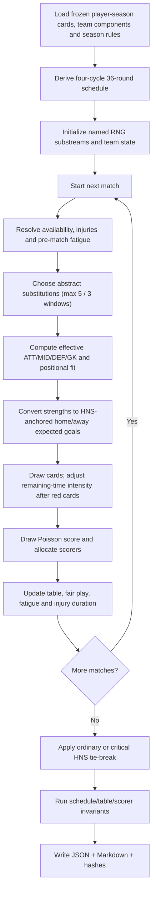

# SimEngine Agent — match and season simulation design

**Prototype:** `sim_engine.py` v0.1.0  
**Research snapshot:** 2026-07-24 (Europe/Zagreb)  
**Status:** deterministic reference implementation, not a fitted forecast or
betting model.

## 1. Rules profile and product modes

The default engine implements the latest official 2026/27 structure: ten clubs
and four cycles (`9 + 9 + 9 + 9 = 36` rounds). Each pair meets four times, twice
at each ground. A win is worth three points and a draw one. These values,
participants and the detailed tie-break sequence are in the
[HNS 2026/27 regulations, Articles 1, 3 and 34](https://hns.family/files/documents/33080/Propozicije%20natjecanja%20SuperSport%20HNL%2026-27.pdf).

| Rule | Authentic-mode implementation | Confidence |
|---|---|---:|
| League size/schedule | 10 teams, 36 rounds, 180 matches; four meetings per pair, 2H/2A | **0.995** |
| Points | Win 3, draw 1, loss 0 | **0.995** |
| Ordinary equal-points order | Overall goal difference, then goals scored; a truly equal ordinary key shares rank even though display order remains stable | **0.99** |
| Critical final tie | Head-to-head mini-table points, H2H GD, overall GD, fair play (yellow −1, sending-off −3), then a seeded draw of lots | **0.99** for rule; **0.95** for code path |
| Critical positions | Reference run passes title (1) and relegation (10). A production season config must also pass that year’s UEFA-qualifying positions. | **0.98** requirement; **0.60** completeness of prototype default |
| Match-day replacements | Up to 12 may be named; at most 5 enter in at most 3 in-play windows. The prototype has an abstract bench and records 3–5 substitutions in 2–3 windows. | **0.995** rule; **0.35** behavior calibration |
| Squad eligibility | Latest rules require at least six nationally trained players on the match sheet and allow five non-exempt foreign players to appear. | **0.99** rule; **0.20** prototype enforcement because the illustrative XI has no drafted bench/eligibility metadata |
| Transfers | Draft and opponent component vectors are locked at season start; no in-season transfers | **1.00** implementation |

The product can keep the name “HNL 38–0,” but it must expose two labels:

- **Authentic HNL / 36–0:** official four-cycle 36-match season.
- **38-match compatibility showcase:** non-canonical. The supplied golden-path
  example adds a disclosed test-only dominance offset. It is a regression/demo
  fixture, not an HNL prediction.

**Section confidence: 0.99** for the rules distinction; **0.46** for the
prototype dynamics until fitted.  
**Reproducibility:** the schedule invariants are tested in
`test_sim_engine.py::test_official_schedule_invariants`.

## 2. Inputs and assumptions

### Calibrated inputs

The completed 2025/26 HNS Semafor results provide:

| Input | Value |
|---|---:|
| Matches | 180 |
| Goals | 479 |
| Home goals/match | 1.4611 |
| Away goals/match | 1.2000 |
| Yellow cards/match | 5.4389 |
| Red cards/match | 0.2056 |

Source: [official HNS Semafor 2025/26 competition](https://semafor.hns.family/en/competitions/100391485/supersport-hnl/details/).
The code splits card rates evenly between teams for an initial symmetric prior.

### Editorial inputs

- Opponent `ATT/MID/DEF/GK` components and every player OVR.
- `beta_attack=0.13`, `beta_defence=0.11`, `beta_cohesion=0.04`.
- Injury incidence/duration, fatigue accumulation/recovery, position-fit
  deduction, abstract bench strength and scorer weights.
- Red-card attack/defence multipliers and timing distribution.
- A cohesion value of zero for every team in the reference run.

The full future model should use player-season, minute-weighted attack/defence
strengths from `research/stats_analyst.md`. Engine v0.1.0 accepts already
aggregated components as a compact executable approximation. It does not call
market value an ability score and does not claim that HNS supplied an OVR.

**Confidence: 0.99** for identifying which inputs are official versus
editorial; **0.18–0.38** for the editorial numerical values.  
**Reproducibility:** all constants appear in `MODEL_CONFIG` and all team inputs
in `default_teams()` in `sim_engine.py`; the JSON output repeats them.

## 3. Rating-to-score computation

For the effective match-day components after position, injury, bench and
fatigue adjustments:

\[
A_i=\frac{0.58\,ATT_i+0.42\,MID_i-75}{10},
\qquad
D_i=\frac{0.65\,DEF_i+0.35\,GK_i-75}{10}.
\]

\[
\begin{aligned}
\log\lambda_H &=
\log(1.4611)+0.13A_H-0.11D_A+0.04(C_H-C_A),\\
\log\lambda_A &=
\log(1.2000)+0.13A_A-0.11D_H+0.04(C_A-C_H).
\end{aligned}
\]

The means are clamped to `[0.05, 6.0]`. Red cards, if drawn, reduce the
dismissed side’s mean and raise the opponent’s according to the fraction of
the match remaining. The score then uses independent Poisson draws. A fitted
Dixon–Coles low-score correction is the recommended next layer; v0.1.0 keeps
`rho=0`, so it does not pretend that an unfitted correction is known.

Poisson attack/defence modeling follows
[Maher (1982)](https://doi.org/10.1111/j.1467-9574.1982.tb00782.x);
the low-score extension is from
[Dixon and Coles (1997)](https://doi.org/10.1111/1467-9876.00065).

**Confidence: 0.88** for the log-Poisson structure; **0.38** for the
OVR/component slopes; **0.20** for injury, fatigue and red-card effects.  
**Reproducibility:** the equations map directly to `attack_strength()`,
`defence_strength()`, `simulate_match()` and `red_card_adjustment()`.

## 4. Match/season pseudocode

```text
FUNCTION simulate_season(master_seed, frozen_teams):
    ASSERT there are exactly 10 teams
    first_leg = Berger/circle round robin(frozen_teams)
    schedule = first_leg
             + reverse_home_away(first_leg)
             + first_leg
             + reverse_home_away(first_leg)
    INITIALIZE team fatigue, injury counters, table and scorer ledger

    FOR round = 1..36:
        ASSERT each team appears once in the round
        FOR each scheduled home, away match:
            event_rng  = SHA256_seed(master_seed, "events", match identity)
            score_rng  = SHA256_seed(master_seed, "score",  match identity)
            scorer_rng = SHA256_seed(master_seed, "scorers", match identity)

            FOR each team:
                decrement prior injury duration
                draw new pre-match and in-match injury events
                choose up to 5 abstract substitutions in at most 3 windows
                calculate fatigue, position-fit, injury and bench adjustment
                aggregate effective attack and defence strength

            lambda_home, lambda_away = log_linear_HNS_goal_means(strengths)
            draw yellow and red cards
            IF red card:
                adjust both goal means by remaining-match fraction

            home_goals = Poisson(score_rng, lambda_home)
            away_goals = Poisson(score_rng, lambda_away)
            allocate every goal with scorer_rng and published scorer weights
            update W/D/L, GF/GA, points, fair play, fatigue and injuries

    RANK equal-points groups:
        ordinary: GD, goals scored
        critical: H2H points, H2H GD, overall GD, fair play, seeded lot

    VALIDATE 180 matches, 36/team, 4/pair, 2H+2A,
             P=W+D+L, Pts=3W+D, sum(GF)=sum(GA),
             and scorer goals = team goals
    WRITE sorted JSON, Markdown summary, content SHA-256 and seed
```

**Confidence: 0.96** that the pseudocode matches engine v0.1.0.  
**Reproducibility:** `python3 -m unittest -v` exercises schedule,
same-seed/different-seed and golden-path checks.

## 5. Control flow



**Confidence: 0.96** for correspondence with the implementation.

## 6. Why named seed streams matter

`derive_seed()` hashes:

```text
master_seed | mode | stream_label | round | match | home | away
```

into a 64-bit seed. Events, score and scorer allocation use distinct streams.
Adding a chart, logging statement or a new scorer field therefore does not
silently change the score draw. Sorting of JSON keys and stable team ordering
produce byte-identical output on repeated runs in the same Python version.

The model should eventually add separate `rating_world`, `availability`,
`substitution`, `discipline` and `score_matrix` streams; the current event
stream groups several editorial events but remains deterministic.

**Confidence: 0.99** for deterministic reproduction in the tested runtime;
**0.92** across future Python versions because standard-library RNG behavior
should still be pinned by an environment lock for archival releases.  
**Reproducibility:** rerunning the supplied commands produced identical file
SHA-256 hashes.

## 7. Reference commands

```bash
cd /Users/josipnigojevic/380HNL
python3 -m unittest -v

python3 sim_engine.py season \
  --seed 38020261743 \
  --output-dir outputs/season_38020261743

python3 sim_engine.py find-perfect \
  --start-seed 1 \
  --max-seeds 100000 \
  --matches 38 \
  --showcase-boost 41

python3 sim_engine.py challenge \
  --seed 474 \
  --matches 38 \
  --showcase-boost 41 \
  --output-dir outputs/challenge_seed_474
```

Expected official-format content hash:
`5844d69f1d654c8c9a2dfe6e5b6a28589725a82159a55abdacbac66d60b1cfc4`.

Expected 38-match showcase content hash:
`940c7dc60c0c2f56c4b2efdbae9db4f3d44c21ec9b480d10b00c2b55ad640198`.

## 8. Known limitations and next gates

1. Opponent identities are official 2026/27 participants, but their component
   ratings and scorer labels are synthetic. A production example must freeze
   licensed rosters and player-season ability estimates.
2. An eleven-card draft does not supply a legal 23-player match sheet. The
   prototype uses an explicit replacement-level abstract bench; authentic squad
   eligibility cannot be certified.
3. Injury and fatigue are stateful but deliberately simple. They are mechanics,
   not inferred medical facts.
4. Red-card incidence is anchored to one season, but its timing and goal impact
   are editorial.
5. Independent Poisson (`rho=0`) can misfit draws/low scores. Enable
   Dixon–Coles only after estimating and validating it.
6. The example seed was selected to make a readable demonstration
   (drafted XI champion, high-rated opponents near the top, promoted Rudeš
   last). This is disclosed selection, not evidence of predictive accuracy.
7. The `+41` 38-match dominance offset is intentionally outside the calibrated
   domain. Its only valid use is a reproducible golden-path test showing that
   the UI and leaderboard can represent 38–0–0/114 points.
8. Semafor and Transfermarkt public terms restrict automated copying; fit on
   data acquired with permission/licence rather than evading controls.

**Overall implementation confidence: 0.93** for determinism and invariants;
**0.42** for qualitative football plausibility; **0.25** for predictive
calibration.

