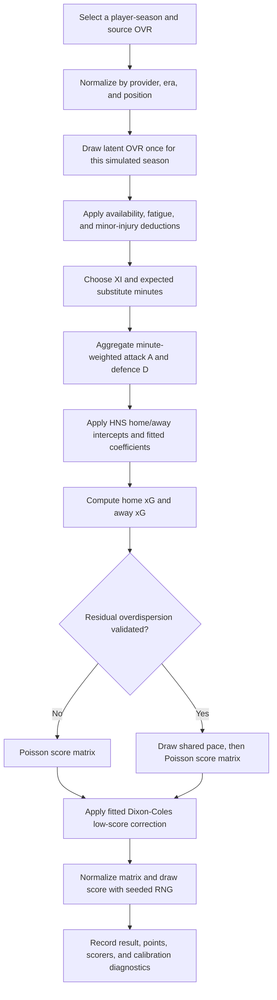

# StatsAnalyst report: converting HNL draft ratings into goals

Research date: 2026-07-24 (Europe/Zagreb).

## Recommendation

Use a **lineup-aware log-linear goal model with a Dixon–Coles score layer**:

1. normalize every player-season rating within its position and era;
2. aggregate the expected players and minutes into separate attack and defence
   strengths;
3. convert those strengths to home and away expected goals with a log link
   anchored to the official 2025/26 HNL means;
4. draw the score from two Poisson distributions and apply the Dixon–Coles
   correction to `0–0`, `0–1`, `1–0`, and `1–1`;
5. propagate player-rating and fitted-parameter uncertainty by drawing one
   latent "world" at the start of each season simulation.

This is more defensible than turning one overall rating directly into a fixed
number of goals. Maher found that attack and defence parameters with Poisson
goals give a reasonable football-score description; Dixon and Coles added
recency and a low-score dependence correction. Separate offence and defence
ratings also match the interpretation used by Soccer Power Index. Sources:
[Maher (1982)](https://doi.org/10.1111/j.1467-9574.1982.tb00782.x),
[Dixon and Coles (1997)](https://doi.org/10.1111/1467-9876.00065), and
[ESPN's SPI explanation](https://www.espn.com/soccer/story/_/id/37367780/soccer-power-index-explained).

**Overall confidence: 0.82** for Poisson/Dixon–Coles as the structural starting
point; **0.38** for the numerical rating coefficients below until they are
estimated on joined HNL lineups, ratings, and results.

## Evidence base

| Finding used here | Modeling consequence | Source | Confidence |
|---|---|---|---:|
| Independent Poisson goals with team attack and defence strengths describe football scores reasonably well, with small systematic departures. | Use a log-linear Poisson mean as the baseline. | [Maher (1982)](https://doi.org/10.1111/j.1467-9574.1982.tb00782.x) | 0.90 |
| Dependence is most important at `0–0`, `0–1`, `1–0`, and `1–1`; recent results should carry greater weight. | Add the four-cell Dixon–Coles correction and exponential time weights. | [Dixon and Coles (1997)](https://doi.org/10.1111/1467-9876.00065) | 0.95 |
| A bivariate Poisson or diagonal inflation can improve draw fit and handle some overdispersion. | Test, but do not automatically stack, bivariate/overdispersed alternatives. | [Karlis and Ntzoufras (2003)](https://doi.org/10.1111/1467-9884.00366) | 0.90 |
| Hierarchical Poisson models shrink attack/defence estimates and yield posterior predictive uncertainty. | Fit seasons and clubs hierarchically, especially in the small HNL sample. | [Baio and Blangiardo (2010), UCL copy](https://discovery.ucl.ac.uk/id/eprint/16040/) | 0.90 |
| Player abilities and the starting XI can enter a team's log scoring intensity as lineup sums. | Make the drafted player-season lineup, not only the club label, drive goals. | [Whitaker et al., *A Bayesian inference approach for determining player abilities in soccer*](https://arxiv.org/abs/1710.00001) | 0.83 |
| SPI interprets offence/defence ratings as goals scored/conceded against an average team and converts projected goals through Poisson score distributions. | Keep separate attack and defence indices and expose expected goals to the player. | [FiveThirtyEight club methodology](https://fivethirtyeight.com/methodology/how-our-club-soccer-predictions-work/) and [ESPN SPI](https://www.espn.com/soccer/story/_/id/37367780/soccer-power-index-explained) | 0.78 |
| Elo's logistic expected score is useful for ranking/update logic but does not identify exact score or draw probabilities by itself. | Use Elo as an optional residual-strength check, not the score generator. | [FIFA men's ranking procedure](https://inside.fifa.com/fifa-world-ranking/procedure-men) | 0.88 |

## Official HNL calibration anchor

The complete official 2025/26 HNS Semafor fixture list contains 180 matches and
479 goals: 263 home goals and 216 away goals. Therefore:

\[
\mu_H = 263/180 = 1.4611,\qquad
\mu_A = 216/180 = 1.2000.
\]

The same results contain 82 home wins, 47 draws, and 51 away wins
(`45.56% / 26.11% / 28.33%`). Source:
[official HNS Semafor 2025/26 competition](https://semafor.hns.family/en/competitions/100391485/supersport-hnl/details/).

The implied equal-strength home scoring multiplier relative to away is
`1.4611 / 1.2000 = 1.2176`, or a log-rate advantage of
`log(1.4611 / 1.2000) = 0.1969`. The canonical equations below use separate
home/away intercepts, so this advantage must **not** be added again.

Approximate Poisson-only 95% intervals for these means are `1.30–1.65` home and
`1.05–1.37` away; they describe count uncertainty only, not season-to-season
variation.

**Confidence: 0.99** for the arithmetic from the official 180 result rows;
**0.72** that one season is representative of a future or cross-era HNL season.
Refit an era-specific intercept when simulating a historical season.

## Exact canonical equations

### 1. Make ratings comparable

Each drafted entity must be a specific **player-season**, not an unspecified
career version. For player \(p\), position group \(q\), and source season \(s\):

\[
z_{p} =
\operatorname{clip}\left(
\frac{r^{\mathrm{eff}}_{p}-\bar r_{q,s}}{10},
-2.5,\ 2.5
\right).
\]

- \(r_p\) is the unified `OVR_Rating` on a 0–100 scale.
- \(\bar r_{q,s}\) is the league/era mean for that position.
- Ten OVR points are initially one model strength unit. Replace `10` with the
  empirical within-position standard deviation if the rating inventory is
  large enough.
- If two rating providers use different scales, first percentile-map each
  provider × season × position distribution to a common normal scale.
- Age is not applied again when the OVR already describes that player-season.

This normalization prevents a raw 1994 rating, a 2026 rating, and ratings from
different positions/providers from being treated as directly interchangeable.

**Confidence: 0.74** for positional/era normalization as a requirement;
**0.35** for the initial ten-point scale.

### 2. Availability, minor injury, and fatigue

For a selected player:

\[
r^{\mathrm{eff}}_{p,t}
=
\operatorname{clip}
\left(r_p - \delta_F F_{p,t} - \delta_M M_{p,t},\ 40,\ 99\right),
\]

where \(F_{p,t}\in[0,1]\) is accumulated fatigue and \(M_{p,t}\in[0,1]\) is a
minor-injury limitation. Initial editorial values are:

\[
\delta_F=4.0\ \text{OVR points},\qquad \delta_M=2.0\ \text{OVR points}.
\]

A player with a major injury or suspension is absent; selecting the replacement
already changes the lineup strength, so do **not** add a second team injury
penalty. If the match engine updates fatigue during play, recompute strength by
time segment. These penalties are game-design priors, not findings from HNS.

**Confidence: 0.30** for the functional form; **0.18** for `4.0` and `2.0`.

### 3. Aggregate the lineup into attack and defence

Let \(m_{p,i}\) be player \(p\)'s expected minutes for team \(i\), capped to
`0–90`, and \(v_{p,i}=m_{p,i}/90\). Use these **editorial relevance weights**:

| Position group | Attack weight \(w^A_q\) | Defence weight \(w^D_q\) |
|---|---:|---:|
| GK | 0.00 | 1.00 |
| CB | 0.25 | 0.85 |
| FB / WB | 0.55 | 0.65 |
| DM | 0.60 | 0.70 |
| CM | 0.75 | 0.55 |
| AM / winger | 0.95 | 0.35 |
| ST / CF | 1.00 | 0.20 |

Then:

\[
A_i =
\frac{\sum_{p\in i}v_{p,i}w^A_{q(p)}z_p}
     {\sum_{p\in i}v_{p,i}w^A_{q(p)}},
\qquad
D_i =
\frac{\sum_{p\in i}v_{p,i}w^D_{q(p)}z_p}
     {\sum_{p\in i}v_{p,i}w^D_{q(p)}}.
\]

Expected minutes across all starters and substitutes should total 990. For an
event-driven simulation, calculate \(A_i,D_i\) from the eleven players actually
on the pitch in each segment instead of forecast minutes.

The normalizing denominators let formations vary without mechanically gaining
strength by using more players assigned to an attacking position. Positional
balance and out-of-position penalties should be applied to the player rating
before these sums.

**Confidence: 0.80** for minute-weighted separate lineup components;
**0.28** for the initial position weights.

### 4. Convert attack and defence to expected goals

Let \(C_i\in[-1,1]\) be an optional cohesion score centered at zero. The
recommended first implementation is:

\[
\begin{aligned}
\eta_H &=
\log(1.4611)
+ \beta_A A_H
- \beta_D D_A
+ \beta_C(C_H-C_A),\\
\eta_A &=
\log(1.2000)
+ \beta_A A_A
- \beta_D D_H
+ \beta_C(C_A-C_H),\\
\lambda_H &= \exp(\eta_H),\qquad
\lambda_A = \exp(\eta_A),
\end{aligned}
\]

with editorial starting coefficients:

\[
\beta_A=0.13,\qquad \beta_D=0.11,\qquad \beta_C=0.04.
\]

Interpretation: one attack-strength unit raises the team's scoring rate by
`exp(0.13)-1 = 13.9%`; one opponent defence-strength unit lowers it by
`1-exp(-0.11) = 10.4%`. Set \(\beta_C=0\) until cohesion has an observable,
reproducible definition.

Numerical safety may clamp each \(\lambda\) to `[0.05, 6.0]`, but any clamped
fixture must be flagged as outside the calibrated domain. During a fitted
historical simulation, learn the intercepts rather than fixing them. If lineup
effects make the schedule-wide mean drift through Jensen's inequality, multiply
all raw home means by

\[
c_H=1.4611\Big/\left(N^{-1}\sum_m\lambda^{raw}_{H,m}\right)
\]

and analogously use \(c_A=1.2000/\overline{\lambda^{raw}_A}\). This preserves
the HNS scoring environment without erasing relative team strength.

**Confidence: 0.88** for the log-link form; **0.38** for
`0.13 / 0.11 / 0.04`.

### 5. Turn expected goals into a score

The transparent baseline is:

\[
X\sim \operatorname{Poisson}(\lambda_H),\qquad
Y\sim \operatorname{Poisson}(\lambda_A).
\]

The recommended joint probability applies Dixon–Coles:

\[
P(X=x,Y=y)
=\tau_\rho(x,y)\,
\operatorname{Pois}(x;\lambda_H)\,
\operatorname{Pois}(y;\lambda_A),
\]

\[
\tau_\rho(x,y)=
\begin{cases}
1-\lambda_H\lambda_A\rho,&x=0,y=0,\\
1+\lambda_H\rho,&x=0,y=1,\\
1+\lambda_A\rho,&x=1,y=0,\\
1-\rho,&x=1,y=1,\\
1,&\text{otherwise}.
\end{cases}
\]

Estimate \(\rho\) from match-level HNL data. Use `rho = 0` until it has been
estimated; do not select a negative value merely because it is conventional.
Every fitted value must satisfy:

\[
\max(-1/\lambda_H,-1/\lambda_A)<\rho<
\min(1,1/(\lambda_H\lambda_A))
\]

for every simulated fixture, ensuring all four factors remain positive.

**Confidence: 0.92** for using a fitted low-score correction; **0.20** for any
unfitted nonzero \(\rho\).

## Rating difference versus goals: chart-ready illustration

For a compact one-dimensional illustration, suppose both teams have the same
formation, attack and defence ratings move together, and their average OVRs are
symmetrically placed around the league mean. If
\(\Delta=\mathrm{OVR}_H-\mathrm{OVR}_A\), the coefficients above reduce to:

\[
\lambda_H=1.4611e^{0.012\Delta},\qquad
\lambda_A=1.2000e^{-0.012\Delta}.
\]

The `0.012` is **editorial**, derived from
`(beta_attack + beta_defence) / 20 = (0.13 + 0.11) / 20`, not estimated from
HNL results. The means at \(\Delta=0\) are official HNS-calibrated data.
Probabilities below use independent Poisson scores (`rho = 0`) truncated only
for calculation at 12 goals; expected points are `3×P(win)+P(draw)`.

| Home-minus-away OVR \(\Delta\) | Home xG | Away xG | Expected goal difference | Home win | Draw | Away win | Home expected points |
|---:|---:|---:|---:|---:|---:|---:|---:|
| -20 | 1.149 | 1.525 | -0.376 | 28.6% | 25.4% | 45.9% | 1.113 |
| -15 | 1.220 | 1.437 | -0.216 | 32.1% | 25.9% | 42.1% | 1.220 |
| -10 | 1.296 | 1.353 | -0.057 | 35.6% | 26.1% | 38.3% | 1.330 |
| -5 | 1.376 | 1.274 | +0.102 | 39.3% | 26.1% | 34.6% | 1.441 |
| 0 | 1.461 | 1.200 | +0.261 | 43.1% | 25.8% | 31.1% | 1.552 |
| +5 | 1.551 | 1.130 | +0.421 | 47.0% | 25.3% | 27.7% | 1.664 |
| +10 | 1.647 | 1.064 | +0.583 | 51.0% | 24.5% | 24.5% | 1.774 |
| +15 | 1.749 | 1.002 | +0.747 | 54.9% | 23.5% | 21.5% | 1.883 |
| +20 | 1.857 | 0.944 | +0.913 | 58.8% | 22.4% | 18.8% | 1.989 |

The HNS season aggregate was `45.6% / 26.1% / 28.3%`, while the equal-strength
\(\Delta=0\) illustration gives `43.1% / 25.8% / 31.1%`. This is a useful
sanity check, not a calibration target: the actual schedule contains unequal
teams, and averaging nonlinear Poisson probabilities is not equivalent to
evaluating one match at average goals.

**Confidence: 1.00** that the table follows the stated equations;
**0.38** that the editorial slope predicts real HNL rating differences.

## Uncertainty and overdispersion

Separate two kinds of randomness:

- **Aleatory match randomness:** draw the score conditional on \(\lambda_H\)
  and \(\lambda_A\).
- **Epistemic uncertainty:** uncertainty in OVRs, position weights, coefficients,
  and scoring environment.

Recommended player-rating standard deviations are `2 OVR` for a well-observed
player-season, `4` for sparse historical data, and `6` for an editorial-only
rating. At the start of each Monte Carlo season \(b\), draw:

\[
r_{p}^{(b)}\sim
\operatorname{TruncatedNormal}(r_p,\sigma_{r,p}^2;40,99)
\]

once and retain it for all 36 matches. Also draw one posterior parameter vector
per simulated season. This avoids implausibly changing a player's true ability
from match to match while still propagating uncertainty into league outcomes.

If rolling validation shows variance materially above the Poisson mean, use a
Gamma–Poisson pace mixture:

\[
G_m\sim\operatorname{Gamma}(k,k),\quad
X_m\mid G_m\sim\operatorname{Pois}(G_m\lambda_H),\quad
Y_m\mid G_m\sim\operatorname{Pois}(G_m\lambda_A).
\]

Here \(E[G_m]=1\) and the marginal variance is
\(\lambda+\lambda^2/k\). A shared \(G_m\) also creates positive score
correlation. Start with this feature disabled; if enabled, use
\(k\sim\operatorname{Gamma}(2,0.1)\) (shape/rate, mean 20) and estimate it.
Compare it against, rather than blindly combining it with, bivariate Poisson
and Dixon–Coles. Karlis and Ntzoufras provide the modeling rationale, while
Baio and Blangiardo provide a hierarchical Poisson-lognormal alternative.

**Confidence: 0.86** for propagating epistemic uncertainty;
**0.45** that an overdispersed layer will improve HNL out-of-sample forecasts.

## Recommended priors and provenance

| Parameter | Recommended prior or initial value | Provenance | Confidence |
|---|---|---|---:|
| \(\log\mu_H\) | \(N(\log 1.4611,0.07^2)\) | HNS 2025/26 anchor; 0.07 approximates one-season count error | 0.85 |
| \(\log\mu_A\) | \(N(\log 1.2000,0.07^2)\) | HNS 2025/26 anchor | 0.85 |
| \(\beta_A\) | \(\log\beta_A\sim N(\log 0.13,0.35^2)\) | Editorial weak prior | 0.35 |
| \(\beta_D\) | \(\log\beta_D\sim N(\log 0.11,0.35^2)\) | Editorial weak prior | 0.35 |
| \(\beta_C\) | \(N(0,0.05^2)\) | Editorial; shrink to zero | 0.25 |
| Fatigue deduction \(\delta_F\) | \(\log\delta_F\sim N(\log4,0.35^2)\) | Editorial | 0.18 |
| Minor-injury deduction \(\delta_M\) | \(\log\delta_M\sim N(\log2,0.40^2)\) | Editorial | 0.18 |
| Dixon–Coles \(\rho\) | \(N(-0.03,0.05^2)\), truncated to positive-probability bounds; runtime default `0` before fitting | Literature-informed weak prior | 0.40 |
| Club attack/defence residual SD | half-normal \(N^+(0,0.15^2)\) | Hierarchical regularization, optional | 0.55 |
| Time-decay half-life | log-normal centered on 730 days with log-SD 0.35 | Editorial two-season start; tune by validation | 0.35 |
| Overdispersion \(k\) | \(\operatorname{Gamma}(2,0.1)\), only if enabled | Weak prior with mean 20 | 0.35 |

For match \(m\) played \(d_m\) days before the fit date, the proposed recency
weight is:

\[
w_m=2^{-d_m/730}.
\]

The original Dixon–Coles framework supports exponential time weighting, but
the 730-day half-life is an HNL game-design starting point, not a value reported
by that paper.

## Optional Elo residual

If the real clubs retain some identity not captured by drafted players (coach,
system, academy, or venue), maintain a small residual Elo \(E_i\):

\[
p_{i>j}^{Elo}=
\frac{1}{1+10^{-(E_i-E_j)/400}},\qquad
E_i' = E_i + K(S_i-p_{i>j}^{Elo}).
\]

Do not feed this full value back into goals after player ratings already encode
team performance. If validation supports it, add a heavily shrunk term
\(\beta_E(E_i-E_j)/400\) to the corresponding log goal means with
\(\beta_E\sim N(0,0.05^2)\). For a pure fantasy draft, set every residual Elo
equal and leave it fixed. FIFA documents the expected-score/update family; it
does not make Elo an exact-score model.

**Confidence: 0.90** for Elo as a result-rating mechanism; **0.30** that it adds
information after lineup ratings in this game.

## Workflow



**Confidence: 0.90** that this is an implementable and auditable workflow.

## Calibration and validation plan

1. **Freeze official match snapshots.** Retain match ID, date, clubs, final
   score, starters, substitutions/minutes, and cards from authorized HNS data.
   Semafor's terms restrict automated copying and redistribution, so production
   collection needs permission or a licensed feed:
   [HNS Semafor terms](https://hns.family/en/hns/info/terms-of-use-semafor-app/).
2. **Join player-season ratings without leakage.** A match may use only a rating
   timestamped before kickoff. Do not use final-season OVR to forecast an early
   season match unless the game explicitly treats OVR as an omniscient
   retrospective rating.
3. **Use rolling-origin folds.** Fit through season \(s-1\), predict every match
   in season \(s\), then advance. Prefer 2013/14 onward for a stable ten-club,
   36-round structure; add season intercepts if using the full 1992–present
   archive.
4. **Fit nested models.** Compare league-mean Poisson; team attack/defence
   Poisson; Dixon–Coles; lineup ratings; then fatigue/cohesion. A feature stays
   only when it improves held-out performance.
5. **Score probabilistic forecasts.** Report mean goal error, exact-score log
   score, 1X2 log loss and ranked probability score, Brier scores, probability
   calibration, and observed-versus-predicted frequencies for `0–0`, `1–0`,
   `0–1`, `1–1`, and 4+ goals.
6. **Check simulation-level calibration.** Across at least 10,000 seeded season
   simulations, compare distributions of total goals, H/D/A proportions,
   champion points, goal difference, and unbeaten seasons with held-out HNL
   seasons.
7. **Publish intervals, not false precision.** Report median and 80%/95%
   simulation intervals for points, rank, and goals, plus the provenance class
   of every drafted rating.

**Confidence: 0.93** that this plan detects major miscalibration; actual
parameter confidence depends on lineup/rating completeness and licensing.

## SimEngine implementation contract

The following defaults reproduce the illustrative table:

```json
{
  "calibration_season": "HNL 2025/26",
  "mu_home": 1.4611,
  "mu_away": 1.2,
  "ovr_points_per_strength_unit": 10.0,
  "beta_attack": 0.13,
  "beta_defence": 0.11,
  "beta_cohesion": 0.04,
  "fatigue_ovr_deduction_at_1": 4.0,
  "minor_injury_ovr_deduction_at_1": 2.0,
  "dixon_coles_rho": 0.0,
  "lambda_min": 0.05,
  "lambda_max": 6.0,
  "time_decay_half_life_days": 730,
  "overdispersion_enabled": false
}
```

Implementation invariants:

- seeded randomness controls rating-world draws, availability, and match-score
  draws through named substreams;
- a major injury changes player availability, not both availability and a
  duplicate team penalty;
- home advantage appears only in `mu_home` versus `mu_away`;
- \(\rho\), if nonzero, is fitted and checked for positive cell probabilities;
- score-matrix tails are extended until omitted mass is below `1e-10`, then the
  matrix is renormalized;
- all fitted configuration, data snapshot hashes, code commit, and master seed
  are written to the run manifest.

Suggested reproducible test seed: `38020260724`. Draw each player-season's
latent rating once from a deterministic `rating_world` substream and retain it
for all fixtures. Use separate deterministic substreams for schedule,
availability, match events, and score draws so adding a chart or log statement
cannot change results.

**Confidence: 0.97** that these settings reproduce the stated illustrative
math; **0.38** that unfitted editorial coefficients are empirically optimal.

## Key limitations

- The official HNS scoring intercept is calibrated; the OVR slope, position
  weights, fatigue, injury, and cohesion values are not.
- Public appearance/goal/card and market-value data are not event-level player
  ability measurements. OVR construction must avoid circularly using the same
  goals that later validate the model.
- One overall rating cannot identify both attack and defence perfectly.
  Position weights are a temporary bridge; separate player attack/defence
  ratings are the preferred future schema.
- A 36-match HNL season has substantial outcome variance. A high-rated team can
  lose without the model being wrong; confidence must be assessed over many
  fixtures and rolling seasons.
- Cross-era drafts are counterfactual. Era normalization makes ratings
  comparable but cannot identify how a 1990s player would respond to modern
  tactics, medicine, pitches, or substitution rules.

**Section confidence: 0.95** that these are material limitations.
